> [[宁猫出品，必属精品！]]


# Sprout

## 项目简介

Sprout项目是深入学习Spring核心思想的实践项目，基于mini-spring优化完善。曾为mini-spring贡献多个被合并的PR，注释与文档经润色更加详尽。项目实现了IoC、AOP、资源加载器、事件监听器、类型转换、容器扩展点、bean生命周期管理、作用域控制、应用上下文、懒加载、包扫描、@Autowired/@Value注解及循环依赖解决等Spring核心功能。

## 使用技术栈

### 核心技术

- **Java 21** - 使用最新的Java特性

- **Maven** - 项目构建和依赖管理

- **Spring Boot 3.4.5** - 作为参考框架版本


### 主要依赖

- **DOM4J 2.1.3** - XML配置文件解析

- **CGLIB 3.3.0** - 字节码增强，实现类代理

- **AspectJ 1.8.0** - 切点表达式解析

- **Hutool 5.8.16** - Java工具类库，简化开发


### 测试框架

- **JUnit 5** - 单元测试框架

- **AssertJ** - 流畅的断言库

## 核心实现功能

### IOC容器

- [x] Bean定义与注册机制

- [x] 单例Bean管理

- [x] 依赖注入（属性注入、构造器注入）

- [x] Bean生命周期管理

- [x] XML配置解析

- [x] 注解驱动开发（@Component、@Autowired、@Value）

- [x] 包扫描机制

- [x] 延迟初始化和原型Bean支持

- [x] 循环依赖解决（二级缓存、三级缓存）


### AOP编程

- [x] JDK动态代理

- [x] CGLIB字节码代理

- [x] AspectJ切点表达式

- [x] 多种通知类型（前置、后置、返回后、异常、环绕）

- [x] 代理工厂和自动代理创建


### 扩展功能

- [x] 事件发布与监听机制

- [x] Aware接口支持

- [x] BeanPostProcessor扩展点

- [x] FactoryBean支持

- [x] 类型转换系统

- [x] 属性占位符解析


## 通过此项目能学到什么


### 设计模式

> 内部配套个人笔记，详细八股！面试直接从spring源码举例，突出自身！

- **工厂模式** - BeanFactory体系设计

- **单例模式** - Bean作用域管理

- **模板方法模式** - AbstractBeanFactory抽象类设计

- **策略模式** - 实例化策略、代理策略

- **代理模式** - AOP动态代理实现

- **观察者模式** - 事件发布订阅机制

- **适配器模式** - 各种Advice适配器

- **责任链模式** - BeanPostProcessor处理链


### 框架设计思想

- **控制反转(IOC)** - 依赖关系的管理和注入

- **面向切面编程(AOP)** - 横切关注点的分离

- **约定优于配置** - 注解驱动开发

- **扩展点设计** - 各种PostProcessor机制

- **生命周期管理** - Bean的完整生命周期


### 核心技术原理

- **反射机制** - 动态创建对象和调用方法

- **注解处理** - 运行时注解解析和处理

- **XML解析** - DOM4J解析配置文件

- **字节码增强** - CGLIB动态生成子类

- **动态代理** - JDK Proxy和CGLIB的使用

- **线程安全** - 单例Bean的线程安全处理

- **循环依赖** - 三级缓存解决循环引用


### 架构设计能力

- **分层架构** - 清晰的模块分层设计

- **接口设计** - 面向接口编程的实践

- **扩展性设计** - 预留扩展点和插件机制

- **异常处理** - 完整的异常体系设计

- **缓存机制** - 多级缓存的设计和实现


### 编程最佳实践

- **代码组织** - 合理的包结构和类设计

- **命名规范** - 清晰的命名约定

- **文档编写** - 详细的代码注释和README

- **测试驱动** - 完整的单元测试覆盖

- **版本管理** - Git分支管理策略


## TODO

> 目前就想到这些

- [ ]  有一些包导入问题，需要修复（不影响使用与学习）
- [ ]  @Lazy注解实现与其解决依赖循环相关
- [ ]  实现Ordered接口的优先级排序机制
- [ ] 事务相关（例如传播机制）
- [ ] 线程池相关


# IOC

## 最简单的Bean容器

直接定义一个Map，实现较为简单，不再叙述

定义一个简单的bean容器BeanFactory，内部包含一个map用以保存bean，只有注册bean和获取bean两个方法
```java
public class BeanFactory {
	private Map<String, Object> beanMap = new HashMap<>();

	public void registerBean(String name, Object bean) {
		beanMap.put(name, bean);
	}

	public Object getBean(String name) {
		return beanMap.get(name);
	}
}
```


## Bean 定义和 Bean 定义注册

> 代码分支：bean-definition-and-bean-definition-registry


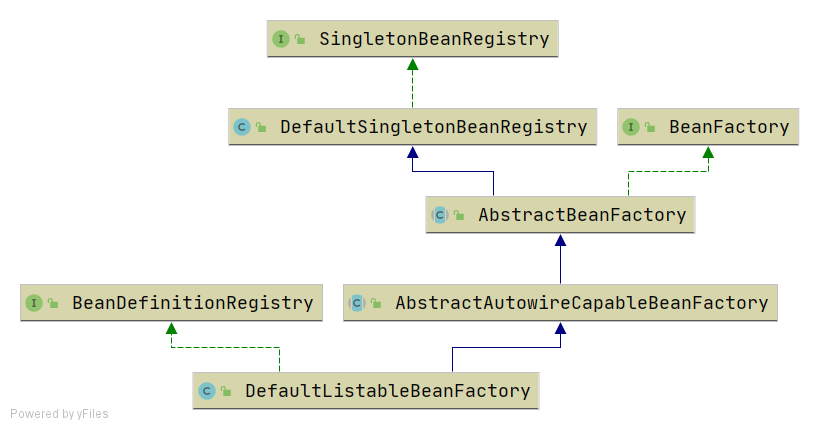

支持单例类的bean定义，实现了bean的定义表，单例bean容器表

- BeanDefinition，顾名思义，用于定义bean信息的类，包含bean的class类型、构造参数、属性值等信息，每个bean对应一个BeanDefinition的实例。简化BeanDefinition仅包含bean的class类型。

测试:

```java
@Test  
public void testBeanFactory() throws Exception {  
    DefaultListableBeanFactory beanFactory = new DefaultListableBeanFactory();  
    
    BeanDefinition beanDefinition = new BeanDefinition(HelloService.class);  
    
    beanFactory.registerBeanDefinition("helloService", beanDefinition);  
  
    HelloService helloService = (HelloService) beanFactory.getBean("helloService");  
    helloService.sayHello();  
}
```


```java
public abstract class AbstractAutowireCapableBeanFactory extends AbstractBeanFactory {  
  
    @Override  
    protected Object createBean(String beanName, BeanDefinition beanDefinition) throws BeansException {  
       return doCreateBean(beanName, beanDefinition);  
    }  
  
    protected Object doCreateBean(String beanName, BeanDefinition beanDefinition) {  
       Class beanClass = beanDefinition.getBeanClass();  
       Object bean = null;  
       try {  
          bean = beanClass.newInstance();  
       } catch (Exception e) {  
          throw new BeansException("Instantiation of bean failed", e);  
       }  
  
       addSingleton(beanName, bean);  
       return bean;  
    }  
}
```

1. 先生成一个bean定义

2. 然后放入定义表

3. 再通过bean定义里面获取类型，根据类型通过反射拿到他的无参构造器

4. 创建bean

5. 放到单例表中并且返回bean

-  **Bean 定义与实例分离：** 不再直接操作 Bean 实例，而是通过 `BeanDefinition` 这个“蓝图”来描述 Bean。这使得配置更加灵活，并为后续的 XML 配置、注解配置打下基础。

-  **延迟实例化：** Bean 不再在容器启动时就全部创建，而是在第一次调用 `getBean()` 时才根据其 `BeanDefinition` 进行实例化。这节省了启动资源，特别是在大型应用中。

-  **单例管理：** 容器自动管理单例 Bean 的生命周期。第一次获取时创建并缓存，后续获取直接返回缓存中的实例，确保 Bean 的单例性。

-  **职责分离：**

    - `BeanDefinitionRegistry` 负责 Bean 定义的注册。

    - `SingletonBeanRegistry` 负责单例 Bean 实例的缓存。

    - `AbstractBeanFactory` 负责 Bean 获取的通用流程（**模板方法**模式）。

    - `AbstractAutowireCapableBeanFactory` 负责 Bean 的实际实例化。

    - `DefaultListableBeanFactory` 则将这些职责聚合起来，成为一个完整的可用于实际场景的 `BeanFactory`。


**工厂模式，单例模式**

Spring 默认使用 Singleton 作用域，主要是出于以下几个原因：

- **性能优化：** 避免了频繁地创建和销毁对象，减少了垃圾回收的压力，提高了应用程序的性能。对于那些不需要保存特定状态的服务类（例如，Service 层、DAO 层组件），创建多个实例是浪费资源的。

- **资源共享：** 很多组件本身就是无状态的，或者其状态是共享的（比如数据库连接池、缓存服务）。使用单例可以方便地共享这些资源。

- **内存效率：** 只需要一份内存来存储对象，节省了宝贵的内存空间。

### 模板模式

**组成部分：**

- **抽象类（Abstract Class）：** 定义了模板方法和算法的骨架。它通常包含：

    - 一个或多个抽象操作（由子类实现）。

    - 一个模板方法（调用抽象操作和具体操作）。

    - 一些具体操作（提供默认实现或完成公共步骤）。

- **具体类（Concrete Class）：** 实现抽象类中定义的抽象操作，以完成算法中特定的步骤。


**优点：**

- **代码复用：** 算法的公共部分在抽象类中实现，避免了子类中的重复代码。

- **控制反转（好莱坞原则）：** 父类控制子类的行为，即“别调用我们，我们来调用你”（Don't call us, we'll call you）。这意味着父类定义了算法的流程，并在需要时调用子类实现的方法。

- **灵活性和扩展性：** 允许子类在不改变算法结构的前提下，对算法的某些步骤进行具体的实现或扩展。


## Bean实例化策略InstantiationStrategy

> 代码分支：instantiation-strategy

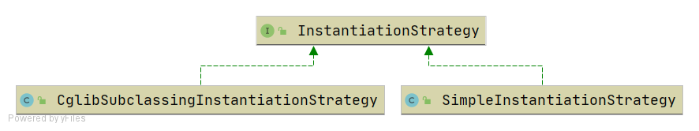

现在bean是在AbstractAutowireCapableBeanFactory.doCreateBean方法中用beanClass.newInstance()来实例化，仅适用于bean有无参构造函数的情况。

针对bean的实例化，抽象出一个实例化策略的接口InstantiationStrategy，有两个实现类：
- SimpleInstantiationStrategy，使用bean的构造函数来实例化
- CglibSubclassingInstantiationStrategy，使用CGLIB动态生成子类


## 为bean填充属性

> 代码分支：populate-bean-with-property-values

在BeanDefinition中增加和bean属性对应的PropertyValues（维护了一个承载PropertyValue列表，里面是key，value），实例化bean之后，为bean填充属性

```java

protected Object doCreateBean(String beanName, BeanDefinition beanDefinition) {  
    Object bean = null;  
    try {  
       bean = createBeanInstance(beanDefinition);  
       //为bean填充属性  
       applyPropertyValues(beanName, bean, beanDefinition);  
    } catch (Exception e) {  
       throw new BeansException("Instantiation of bean failed", e);  
    }  
  
    addSingleton(beanName, bean);  
    return bean;  
}

/**  
 * 为bean填充属性  
 *  
 * @param bean  
 * @param beanDefinition  
 */  
protected void applyPropertyValues(String beanName, Object bean, BeanDefinition beanDefinition) {  
    try {  
       for (PropertyValue propertyValue : beanDefinition.getPropertyValues().getPropertyValues()) {  
          String name = propertyValue.getName();  
          Object value = propertyValue.getValue();  
  
          //通过反射设置属性  
          BeanUtil.setFieldValue(bean, name, value);  
       }  
    } catch (Exception ex) {  
       throw new BeansException("Error setting property values for bean: " + beanName, ex);  
    }  
}
```


测试:

```java
@Test  
public void testPopulateBeanWithPropertyValues() throws Exception {  
    DefaultListableBeanFactory beanFactory = new DefaultListableBeanFactory();  
    PropertyValues propertyValues = new PropertyValues();  
    propertyValues.addPropertyValue(new PropertyValue("name", "derek"));  
    propertyValues.addPropertyValue(new PropertyValue("age", 18));  
    BeanDefinition beanDefinition = new BeanDefinition(Person.class, propertyValues);  
    beanFactory.registerBeanDefinition("person", beanDefinition);  
  
    Person person = (Person) beanFactory.getBean("person");  
    System.out.println(person);  
    assertThat(person.getName()).isEqualTo("derek");  
    assertThat(person.getAge()).isEqualTo(18);  
}
```


## 为bean注入bean

> 代码分支：populate-bean-with-property-values

增加BeanReference类，包装一个bean对另一个bean的引用。实例化beanA后填充属性时，若PropertyValue#value为BeanReference，引用beanB，则先去实例化beanB。
由于不想增加代码的复杂度提高理解难度，暂时不支持循环依赖，后面会在高级篇中解决该问题。

```java
protected void applyPropertyValues(String beanName, Object bean, BeanDefinition beanDefinition) {
    try {
        for (PropertyValue propertyValue : beanDefinition.getPropertyValues().getPropertyValues()) {
            String name = propertyValue.getName();
            Object value = propertyValue.getValue();
            if (value instanceof BeanReference) {
                // beanA依赖beanB，先实例化beanB
                BeanReference beanReference = (BeanReference) value;
                value = getBean(beanReference.getBeanName());
            }

            //通过反射设置属性
            BeanUtil.setFieldValue(bean, name, value);
        }
    } catch (Exception ex) {
        throw new BeansException("Error setting property values for bean: " + beanName, ex);
    }
}
```

测试

```java
/**  
 * 为bean注入bean  
 * * @throws Exception  
 */@Test  
public void testPopulateBeanWithBean() throws Exception {  
    DefaultListableBeanFactory beanFactory = new DefaultListableBeanFactory();  
  
    //注册Car实例  
    PropertyValues propertyValuesForCar = new PropertyValues();  
    propertyValuesForCar.addPropertyValue(new PropertyValue("brand", "porsche"));  
    BeanDefinition carBeanDefinition = new BeanDefinition(Car.class, propertyValuesForCar);  
    beanFactory.registerBeanDefinition("car", carBeanDefinition);  
  
    //注册Person实例  
    PropertyValues propertyValuesForPerson = new PropertyValues();  
    propertyValuesForPerson.addPropertyValue(new PropertyValue("name", "derek"));  
    propertyValuesForPerson.addPropertyValue(new PropertyValue("age", 18));  
    //Person实例依赖Car实例  
    propertyValuesForPerson.addPropertyValue(new PropertyValue("car", new BeanReference("car")));  
    BeanDefinition beanDefinition = new BeanDefinition(Person.class, propertyValuesForPerson);  
    beanFactory.registerBeanDefinition("person", beanDefinition);  
  
    Person person = (Person) beanFactory.getBean("person");  
    System.out.println(person);  
    assertThat(person.getName()).isEqualTo("derek");  
    assertThat(person.getAge()).isEqualTo(18);  
    Car car = person.getCar();  
    assertThat(car).isNotNull();  
    assertThat(car.getBrand()).isEqualTo("porsche");  
}
```


## 资源和资源加载器

> 代码分支：resource-and-resource-loader

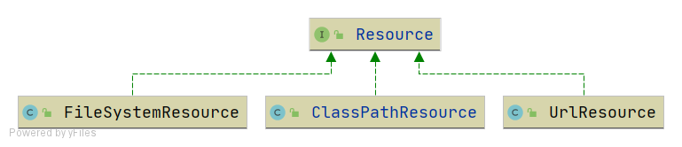

Resource是资源的抽象和访问接口，简单写了三个实现类

- FileSystemResource，文件系统资源的实现类
- ClassPathResource，classpath下资源的实现类
- UrlResource，对java.net.URL进行资源定位的实现类

ResourceLoader接口则是资源查找定位策略的抽象，DefaultResourceLoader是其默认实现类
先找哪个策略，再拿流

**策略模式**

```java
public class ClassPathResource implements Resource {  
  
    private final String path;  
  
    public ClassPathResource(String path) {  
       this.path = path;  
    }  
  
    @Override  
    public InputStream getInputStream() throws IOException {  
       InputStream is = this.getClass().getClassLoader().getResourceAsStream(this.path);   // 应用类类加载器
       if (is == null) {  
          throw new FileNotFoundException(this.path + " cannot be opened because it does not exist");  
       }  
       return is;  
    }  
}

public class FileSystemResource implements Resource {  
  
    private final String filePath;  
  
    public FileSystemResource(String filePath) {  
       this.filePath = filePath;  
    }  
  
    @Override  
    public InputStream getInputStream() throws IOException {  
  
       try {  
          Path path = new File(this.filePath).toPath();  
          return Files.newInputStream(path);  
       } catch (NoSuchFileException ex) {  
          throw new FileNotFoundException(ex.getMessage());  
       }  
    }  
}

public class UrlResource implements Resource {  
  
    private final URL url;  
  
    public UrlResource(URL url) {  
       this.url = url;  
    }  
  
    @Override  
    public InputStream getInputStream() throws IOException {  
       URLConnection con = this.url.openConnection();  
       try {  
          return con.getInputStream();  
       } catch (IOException ex) {  
          throw ex;  
       }  
    }  
}
```

```java
public class DefaultResourceLoader implements ResourceLoader {  
  
    public static final String CLASSPATH_URL_PREFIX = "classpath:";  
  
    @Override  
    public Resource getResource(String location) {  
       if (location.startsWith(CLASSPATH_URL_PREFIX)) {  
          //classpath下的资源  
          return new ClassPathResource(location.substring(CLASSPATH_URL_PREFIX.length()));  
       } else {  
          try {  
             //尝试当成url来处理  
             URL url = new URL(location);  
             return new UrlResource(url);  
          } catch (MalformedURLException ex) {  
             //当成文件系统下的资源处理  
             return new FileSystemResource(location);  
          }  
       }  
    }  
}
```

测试

```java
@Test  
public void testResourceLoader() throws Exception {  
    DefaultResourceLoader resourceLoader = new DefaultResourceLoader();  
  
    //加载classpath下的资源  
    Resource resource = resourceLoader.getResource("classpath:hello.txt");  
    InputStream inputStream = resource.getInputStream();  
    String content = IoUtil.readUtf8(inputStream);  
    System.out.println(content);  
    assertThat(content).isEqualTo("hello world");  
  
    //加载文件系统资源  
    resource = resourceLoader.getResource("src/test/resources/hello.txt");  
    assertThat(resource instanceof FileSystemResource).isTrue();  
    inputStream = resource.getInputStream();  
    content = IoUtil.readUtf8(inputStream);  
    System.out.println(content);  
    assertThat(content).isEqualTo("hello world");  
  
    //加载url资源  
    resource = resourceLoader.getResource("https://www.baidu.com");  
    assertThat(resource instanceof UrlResource).isTrue();  
    inputStream = resource.getInputStream();  
    content = IoUtil.readUtf8(inputStream);  
    System.out.println(content);  
}
```

| 特性        | `ClassPathResource` (类路径)                             | 文件路径 (`java.io.File`) | URL                    |
| --------- | ----------------------------------------------------- | --------------------- | ---------------------- |
| **资源位置**  | Java 应用类路径内部（JAR/WAR 包中）                              | 操作系统文件系统              | 任何可通过 URL 访问的资源（本地、网络） |
| **查找机制**  | 类加载器（ClassLoader）                                     | 操作系统文件系统 API          | URL 协议处理器（网络协议、文件协议）   |
| **部署依赖性** | **不依赖**具体部署路径，高度可移植                                   | **强依赖**部署环境的文件系统结构    | 可能依赖网络连接               |
| **读写能力**  | 通常**只读**                                              | **读写**皆可              | 通常**只读**（用于下载或访问）      |
| **路径类型**  | 相对类路径根目录                                              | 绝对路径或相对当前工作目录         | 完整的 URL 字符串            |
| **典型用途**  | 读取应用程序内部的配置文件（如 `application.properties`）、模板文件、静态资源等。 | 日志、用户数据、独立外部文件        | 网页内容、API 响应、网络文件下载     |

## 在xml文件中定义bean

> 代码分支：xml-file-define-bean

有了资源加载器，就可以在xml格式配置文件中声明式地定义bean的信息，资源加载器读取xml文件，解析出bean的信息，然后往容器中注册BeanDefinition。

BeanDefinitionReader是读取bean定义信息的抽象接口，XmlBeanDefinitionReader是从xml文件中读取的实现类。BeanDefinitionReader需要有获取资源的能力，且读取bean定义信息后需要往容器中注册BeanDefinition，因此BeanDefinitionReader的抽象实现类AbstractBeanDefinitionReader拥有ResourceLoader和BeanDefinitionRegistry两个属性。

由于从xml文件中读取的内容是String类型，所以属性仅支持String类型和引用其他Bean。后面会讲到类型转换器，实现类型转换。

为了方便后面的讲解和功能实现，并且尽量保持和spring中BeanFactory的继承层次一致，对BeanFactory的继承层次稍微做了调整。

里面可能有很多方法比如（根据类型获取所有该类型的bean等等）
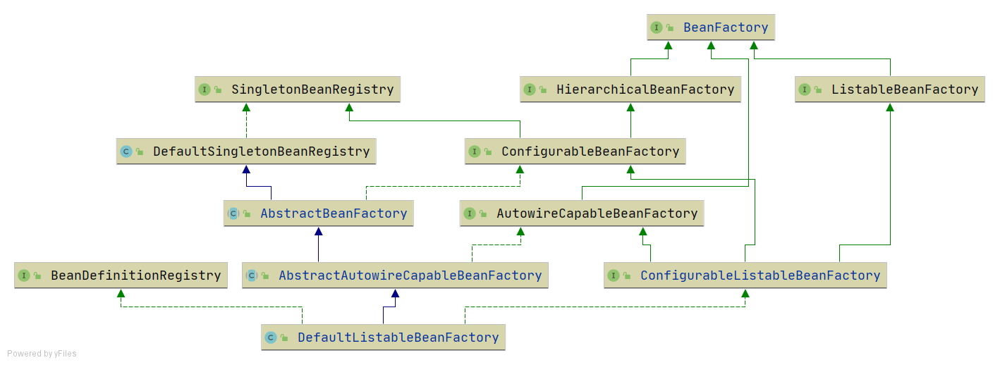

```java
/**  
 * 读取配置在xml文件中的bean定义信息  
 */
 public class XmlBeanDefinitionReader extends AbstractBeanDefinitionReader {  
  
    public static final String BEAN_ELEMENT = "bean";  
    public static final String PROPERTY_ELEMENT = "property";  
    public static final String ID_ATTRIBUTE = "id";  
    public static final String NAME_ATTRIBUTE = "name";  
    public static final String CLASS_ATTRIBUTE = "class";  
    public static final String VALUE_ATTRIBUTE = "value";  
    public static final String REF_ATTRIBUTE = "ref";  
  
    public XmlBeanDefinitionReader(BeanDefinitionRegistry registry) {  
       super(registry);  
    }  
  
    public XmlBeanDefinitionReader(BeanDefinitionRegistry registry, ResourceLoader resourceLoader) {  
       super(registry, resourceLoader);  
    }  
  
    @Override  
    public void loadBeanDefinitions(String location) throws BeansException {  
       ResourceLoader resourceLoader = getResourceLoader();  // 默认里面是创建了一个DefaultResourceLoader
       Resource resource = resourceLoader.getResource(location);  
       loadBeanDefinitions(resource);  
    }  
  
    @Override  
    public void loadBeanDefinitions(Resource resource) throws BeansException {  
       try {  
          InputStream inputStream = resource.getInputStream();  
          try {  
             doLoadBeanDefinitions(inputStream);  
          } finally {  
             inputStream.close();  
          }  
       } catch (IOException ex) {  
          throw new BeansException("IOException parsing XML document from " + resource, ex);  
       }  
    }  
      
    /**  
     * 解析 XML 中的 bean 定义，并注册到 BeanDefinitionRegistry 中  
     *  
     * @param inputStream 输入流，读取 XML 配置文件内容  
     */  
    protected void doLoadBeanDefinitions(InputStream inputStream) {  
       // 解析 XML，得到文档对象  
       Document document = XmlUtil.readXML(inputStream);  
         
       // 获取根元素 <beans>       Element root = document.getDocumentElement();  
         
       // 获取根元素下的所有子节点（包括空白、换行、注释、<bean>等）  
       NodeList childNodes = root.getChildNodes();  
         
       // 遍历所有子节点  
       for (int i = 0; i < childNodes.getLength(); i++) {  
          // 只处理元素类型的节点（排除空白或注释）  
          if (childNodes.item(i) instanceof Element) {  
             // 判断是否是 <bean> 标签  
             if (BEAN_ELEMENT.equals(childNodes.item(i).getNodeName())) {  
                // 强转为 Element 类型  
                Element bean = (Element) childNodes.item(i);  
                  
                // 获取 <bean> 标签的属性  
                String id = bean.getAttribute(ID_ATTRIBUTE);         // bean 的唯一标识 id                String name = bean.getAttribute(NAME_ATTRIBUTE);     // 备用名称 name                String className = bean.getAttribute(CLASS_ATTRIBUTE); // bean 的全类名 class                // 通过反射获取 Class 对象  
                Class<?> clazz = null;  
                try {  
                   clazz = Class.forName(className);  
                } catch (ClassNotFoundException e) {  
                   throw new BeansException("Cannot find class [" + className + "]");  
                }  
                  
                // 优先使用 id，其次使用 name，最后使用类名首字母小写  
                String beanName = StrUtil.isNotEmpty(id) ? id : name;  
                if (StrUtil.isEmpty(beanName)) {  
                   // 如果 id 和 name 都为空，则使用类名首字母小写作为默认名称  
                   beanName = StrUtil.lowerFirst(clazz.getSimpleName());  
                }  
                  
                // 创建 BeanDefinition 对象，记录 bean 的 class 信息  
                BeanDefinition beanDefinition = new BeanDefinition(clazz);  
                  
                // 处理 <bean> 标签内部的 <property> 子标签  
                for (int j = 0; j < bean.getChildNodes().getLength(); j++) {  
                   if (bean.getChildNodes().item(j) instanceof Element) {  
                      Element property = (Element) bean.getChildNodes().item(j);  
                      // 判断是否为 <property> 标签  
                      if (PROPERTY_ELEMENT.equals(property.getNodeName())) {  
                         // 获取 property 的 name、value、ref 属性  
                         String nameAttribute = property.getAttribute(NAME_ATTRIBUTE);  
                         String valueAttribute = property.getAttribute(VALUE_ATTRIBUTE);  
                         String refAttribute = property.getAttribute(REF_ATTRIBUTE);  
                           
                         // name 是必须的  
                         if (StrUtil.isEmpty(nameAttribute)) {  
                            throw new BeansException("The name attribute cannot be null or empty");  
                         }  
                           
                         // 属性值的处理逻辑：如果有 ref，则创建 BeanReference，否则用 value                         Object value = valueAttribute;  
                         if (StrUtil.isNotEmpty(refAttribute)) {  
                            value = new BeanReference(refAttribute);  
                         }  
                           
                         // 创建 PropertyValue 并添加到 beanDefinition 中  
                         PropertyValue propertyValue = new PropertyValue(nameAttribute, value);  
                         beanDefinition.getPropertyValues().addPropertyValue(propertyValue);  
                      }  
                   }  
                }  
                  
                // 检查是否存在重复的 beanName，防止重复注册  
                if (getRegistry().containsBeanDefinition(beanName)) {  
                   throw new BeansException("Duplicate beanName[" + beanName + "] is not allowed");  
                }  
                  
                // 将解析完成的 BeanDefinition 注册到容器中  
                getRegistry().registerBeanDefinition(beanName, beanDefinition);  
             }  
          }  
       }  
    }  
}
```

测试

bean定义文件spring.xml
```xml
<?xml version="1.0" encoding="UTF-8"?>
<beans xmlns="http://www.springframework.org/schema/beans"
       xmlns:xsi="http://www.w3.org/2001/XMLSchema-instance"
       xmlns:context="http://www.springframework.org/schema/context"
       xsi:schemaLocation="http://www.springframework.org/schema/beans
	         http://www.springframework.org/schema/beans/spring-beans.xsd
		 http://www.springframework.org/schema/context
		 http://www.springframework.org/schema/context/spring-context-4.0.xsd">

    <bean id="person" class="org.springframework.test.bean.Person">
        <property name="name" value="derek"/>
        <property name="car" ref="car"/>
    </bean>

    <bean id="car" class="org.springframework.test.bean.Car">
        <property name="brand" value="porsche"/>
    </bean>

</beans>
```

```java
@Test  
public void testXmlFile() throws Exception {  
    DefaultListableBeanFactory beanFactory = new DefaultListableBeanFactory();  
    XmlBeanDefinitionReader beanDefinitionReader = new XmlBeanDefinitionReader(beanFactory);  
    beanDefinitionReader.loadBeanDefinitions("classpath:spring.xml");  
  
    Person person = (Person) beanFactory.getBean("person");  
    System.out.println(person);  
    assertThat(person.getName()).isEqualTo("derek");  
    assertThat(person.getCar().getBrand()).isEqualTo("porsche");  
  
    Car car = (Car) beanFactory.getBean("car");  
    System.out.println(car);  
    assertThat(car.getBrand()).isEqualTo("porsche");  
}
```


## BeanFactoryPostProcessor和BeanPostProcessor

> 代码分支：bean-factory-post-processor-and-bean-post-processor

BeanFactoryPostProcessor和BeanPostProcessor是spring框架中具有重量级地位的两个接口，理解了这两个接口的作用，基本就理解spring的核心原理了。

### `BeanFactoryPostProcessor`：修改 Bean 定义

`BeanFactoryPostProcessor` 是 Spring 容器提供的一个扩展点，它允许你在 **Bean 实例化之前** 修改或处理 Bean 的定义信息（`BeanDefinition`）。这意味着你可以在 Spring 真正创建 Bean 实例之前，对它们的配置进行调整。

#### 作用时机

`BeanFactoryPostProcessor` 的方法在所有 `BeanDefinition` 加载完成之后，但任何 Bean 实例被创建之前调用。

#### 核心能力

通过 `BeanFactoryPostProcessor`，你可以：

- **修改 Bean 的属性值：** 比如更改 `BeanDefinition` 中定义的某个 Bean 的初始属性值。

- **添加或移除 Bean 定义：** 在容器启动时动态地注册新的 Bean 定义，或者移除不需要的 Bean 定义。

- **自定义 Bean 的作用域：** 修改 Bean 的单例或原型等作用域设置。


#### 典型应用


- **`PropertyPlaceholderConfigurer` (Spring 3.1 之前，现在常用 `PropertySourcesPlaceholderConfigurer`)**： 它的作用是读取外部的 `.properties` 文件，然后用这些文件中的配置值来替换 Spring XML 或注解配置中的**占位符**（例如 `${jdbc.url}`）。这使得你可以将敏感信息或环境相关的配置外部化，而无需修改代码或 Bean 定义。

- **`CustomEditorConfigurer`**： 它允许你注册自定义的属性编辑器（`PropertyEditor`），以便 Spring 容器在将字符串属性值转换为特定 Java 类型时，能够按照你定义的逻辑进行转换。例如，将一个字符串日期格式转换为 `java.util.Date` 对象。


### `BeanPostProcessor`：修改 Bean 实例

与 `BeanFactoryPostProcessor` 不同，`BeanPostProcessor` 也是 Spring 提供的容器扩展机制，但它作用于 **Bean 实例化之后**。它允许你在 Bean 实例初始化前后对其进行修改，甚至替换 Bean 实例。

他可能有很多，是一个链式的
#### 作用时机

`BeanPostProcessor` 提供了两个回调方法：

1. 在 Bean 的**初始化方法执行之前**调用。

2. 在 Bean 的**初始化方法执行之后**调用。


这里的“初始化方法”指的是 Bean 自己定义的初始化方法（例如通过 `@PostConstruct` 注解或 `init-method` 配置）。

#### 核心能力

通过 `BeanPostProcessor`，你可以：

- **在 Bean 初始化前后执行自定义逻辑：** 例如，检查某个 Bean 是否实现了特定的接口，并根据需要添加额外的功能。

- **包装（Wrap）Bean 实例：** 这是它最重要的应用之一。`BeanPostProcessor` 可以在 Bean 初始化之后返回一个代理对象，而不是原始的 Bean 实例。这正是 Spring **AOP (面向切面编程)** 实现的关键。Spring 的 AOP 功能就是通过 `BeanPostProcessor` 来为目标 Bean 创建代理，从而在方法调用前后插入切面逻辑。

- **修改 Bean 实例的属性：** 尽管不如 `BeanFactoryPostProcessor` 作用于定义层面那么常见，但你也可以在 Bean 实例被完全初始化后，修改其属性。


#### 典型应用

- **AOP 代理：** Spring AOP 使用 `BeanPostProcessor` 来创建代理对象，拦截方法调用。

- **注解处理：** 许多 Spring 的注解（如 `@Autowired`、`@Transactional`）的实现都依赖于 `BeanPostProcessor` 来扫描和处理 Bean 实例。例如，`AutowiredAnnotationBeanPostProcessor` 负责处理 `@Autowired` 注解，为字段和方法注入依赖。

- **生命周期回调：** Spring 内部的许多生命周期接口（如 `InitializingBean`）的实现，也间接依赖于 `BeanPostProcessor` 来触发相应的方法。

BeanPostProcessor的两个方法分别在bean执行初始化方法（后面实现）之前和之后执行，理解其实现重点看单元测试BeanFactoryPostProcessorAndBeanPostProcessorTest#testBeanPostProcessor和AbstractAutowireCapableBeanFactory#initializeBean方法，有些地方做了微调，可不必关注。

在BeanFactory里面有一个`BeanPostProcessor`列表字段

```java
  
protected Object doCreateBean(String beanName, BeanDefinition beanDefinition) {  
    Object bean = null;  
    try {  
       bean = createBeanInstance(beanDefinition);  
       //为bean填充属性  
       applyPropertyValues(beanName, bean, beanDefinition);  
       //执行bean的初始化方法和BeanPostProcessor的前置和后置处理方法  
       bean = initializeBean(beanName, bean, beanDefinition);  
    } catch (Exception e) {  
       throw new BeansException("Instantiation of bean failed", e);  
    }  
  
    addSingleton(beanName, bean);  
    return bean;  
}

  
protected Object initializeBean(String beanName, Object bean, BeanDefinition beanDefinition) {  
    //执行BeanPostProcessor的前置处理  
    Object wrappedBean = applyBeanPostProcessorsBeforeInitialization(bean, beanName);  
  
    //TODO 后面会在此处执行bean的初始化方法  
    invokeInitMethods(beanName, wrappedBean, beanDefinition);  
  
    //执行BeanPostProcessor的后置处理  
    wrappedBean = applyBeanPostProcessorsAfterInitialization(bean, beanName);  
    return wrappedBean;  
}  
  
@Override  
public Object applyBeanPostProcessorsBeforeInitialization(Object existingBean, String beanName)  
       throws BeansException {  
    Object result = existingBean;  
    for (BeanPostProcessor processor : getBeanPostProcessors()) {  
       Object current = processor.postProcessBeforeInitialization(result, beanName);  
       if (current == null) {  
          return result;  
       }  
       result = current;  
    }  
    return result;  
}  
  
@Override  
public Object applyBeanPostProcessorsAfterInitialization(Object existingBean, String beanName)  
       throws BeansException {  
  
    Object result = existingBean;  
    for (BeanPostProcessor processor : getBeanPostProcessors()) {  
       Object current = processor.postProcessAfterInitialization(result, beanName);  
       if (current == null) {  
          return result;  
       }  
       result = current;  
    }  
    return result;  
}  
  
/**  
 * 执行bean的初始化方法  
 *  
 * @param beanName  
 * @param bean  
 * @param beanDefinition  
 * @throws Throwable  
 */protected void invokeInitMethods(String beanName, Object bean, BeanDefinition beanDefinition) {  
    //TODO 后面会实现  
    System.out.println("执行bean[" + beanName + "]的初始化方法");  
}

```

根据 Spring 的约定，如果 `BeanPostProcessor` 的 `postProcessBeforeInitialization` 方法**返回 `null`**，这意味着该 `BeanPostProcessor` 决定**阻止**后续的 `BeanPostProcessor` 继续处理这个 Bean，并且当前 Bean 的初始化过程也将终止（或者说，后续的初始化步骤不会再基于这个 `Bean` 实例执行）。

典型的**责任链模式**和**策略模式（容器在处理 Bean 初始化时，会“选择”并执行所有注册的 `BeanPostProcessor` 策略。不同的 `BeanPostProcessor` 实现（如 AOP 代理、注解处理等）代表了不同的策略。）**


测试

```java
public class CustomBeanFactoryPostProcessor implements BeanFactoryPostProcessor {  
  
    @Override  
    public void postProcessBeanFactory(ConfigurableListableBeanFactory beanFactory) throws BeansException {  
       BeanDefinition personBeanDefiniton = beanFactory.getBeanDefinition("person");  
       PropertyValues propertyValues = personBeanDefiniton.getPropertyValues();  
       //将person的name属性改为ivy  
       propertyValues.addPropertyValue(new PropertyValue("name", "ivy"));  
    }  
}
```

```java
public class CustomerBeanPostProcessor implements BeanPostProcessor {  
    @Override  
    public Object postProcessBeforeInitialization(Object bean, String beanName) throws BeansException {  
       System.out.println("CustomerBeanPostProcessor#postProcessBeforeInitialization");  
       //换兰博基尼  
       if ("car".equals(beanName)) {  
          ((Car) bean).setBrand("lamborghini");  
       }  
       return bean;  
    }  
  
    @Override  
    public Object postProcessAfterInitialization(Object bean, String beanName) throws BeansException {  
       System.out.println("CustomerBeanPostProcessor#postProcessAfterInitialization");  
       return bean;  
    }  
}
```


```java
public class BeanFactoryProcessorAndBeanPostProcessorTest {

	@Test
	public void testBeanFactoryPostProcessor() throws Exception {
		DefaultListableBeanFactory beanFactory = new DefaultListableBeanFactory();
		XmlBeanDefinitionReader beanDefinitionReader = new XmlBeanDefinitionReader(beanFactory);
		beanDefinitionReader.loadBeanDefinitions("classpath:spring.xml");

		//在所有BeanDefintion加载完成后，但在bean实例化之前，修改BeanDefinition的属性值
		CustomBeanFactoryPostProcessor beanFactoryPostProcessor = new CustomBeanFactoryPostProcessor();
		beanFactoryPostProcessor.postProcessBeanFactory(beanFactory);

		Person person = (Person) beanFactory.getBean("person");
		System.out.println(person);
		//name属性在CustomBeanFactoryPostProcessor中被修改为ivy
		assertThat(person.getName()).isEqualTo("ivy");
	}

	@Test
	public void testBeanPostProcessor() throws Exception {
		DefaultListableBeanFactory beanFactory = new DefaultListableBeanFactory();
		XmlBeanDefinitionReader beanDefinitionReader = new XmlBeanDefinitionReader(beanFactory);
		beanDefinitionReader.loadBeanDefinitions("classpath:spring.xml");

		//添加bean实例化后的处理器
		CustomerBeanPostProcessor customerBeanPostProcessor = new CustomerBeanPostProcessor();
		beanFactory.addBeanPostProcessor(customerBeanPostProcessor);

		Car car = (Car) beanFactory.getBean("car");
		System.out.println(car);
		//brand属性在CustomerBeanPostProcessor中被修改为lamborghini
		assertThat(car.getBrand()).isEqualTo("lamborghini");
	}
}
```

## 应用上下文ApplicationContext

> 代码分支：application-context

应用上下文ApplicationContext是spring中较之于BeanFactory更为先进的IOC容器，ApplicationContext除了拥有BeanFactory的所有功能外，还有如下功能

- **自动识别特殊类型 Bean**：`ApplicationContext` 能够自动识别并注册特定的 Bean 类型，如 `BeanFactoryPostProcessor` 和 `BeanPostProcessor`。这意味着您只需在 XML 配置文件中定义这些 Bean，容器就会自动发现并应用它们，而无需像使用 `BeanFactory` 时那样手动添加到容器中，大大简化了配置和管理。

- **资源加载**：它支持从文件系统、Classpath、URL 等多种位置加载资源，使得外部配置文件的读取更加灵活。

- **容器事件和监听器**：`ApplicationContext` 实现了事件发布机制，允许 Bean 之间通过发布和监听事件进行解耦通信。

- **国际化支持（I18n）**：它提供了对多语言环境的支持，方便应用程序实现国际化。

- **单例 Bean 自动初始化**：默认情况下，`ApplicationContext` 会在启动时自动实例化所有定义为单例的 Bean，确保它们在需要时立即可用，避免了首次访问时的延迟。


简而言之，**`BeanFactory` 是 Spring 的底层基础设施，更面向 Spring 自身的设计；而 `ApplicationContext` 则面向 Spring 的使用者，提供了更丰富的功能和更便捷的开发体验。** 在实际应用开发中，推荐始终使用 `ApplicationContext`。

目前Bean的生命周期

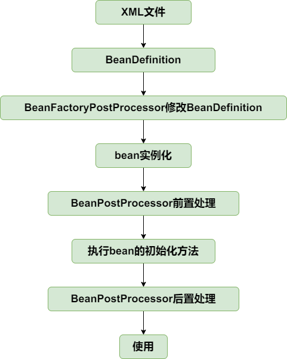


```java
public class ClassPathXmlApplicationContext extends AbstractXmlApplicationContext {  
  
    private String[] configLocations;  
  
    /**  
     * 从xml文件加载BeanDefinition，并且自动刷新上下文  
     *  
     * @param configLocation xml配置文件  
     * @throws BeansException 应用上下文创建失败  
     */  
    public ClassPathXmlApplicationContext(String configLocation) throws BeansException {  
       this(new String[]{configLocation});  
    }  
  
    /**  
     * 从xml文件加载BeanDefinition，并且自动刷新上下文  
     *  
     * @param configLocations xml配置文件  
     * @throws BeansException 应用上下文创建失败  
     */  
    public ClassPathXmlApplicationContext(String[] configLocations) throws BeansException {  
       this.configLocations = configLocations;  
       refresh();  
    }  
  
    @Override  
    protected String[] getConfigLocations() {  
       return this.configLocations;  
    }  
}
```

```java
public abstract class AbstractApplicationContext extends DefaultResourceLoader implements ConfigurableApplicationContext {  
  
    @Override  
    public void refresh() throws BeansException {  
       //创建BeanFactory，并加载BeanDefinition  
       refreshBeanFactory();  
       ConfigurableListableBeanFactory beanFactory = getBeanFactory();  
  
       //在bean实例化之前，执行BeanFactoryPostProcessor  
       invokeBeanFactoryPostProcessors(beanFactory);  
  
       //BeanPostProcessor需要提前与其他bean实例化之前注册  
       registerBeanPostProcessors(beanFactory);  
  
       //提前实例化单例bean  
       beanFactory.preInstantiateSingletons();  
    }  
  
    /**  
     * 创建BeanFactory，并加载BeanDefinition  
     *     * @throws BeansException  
     */    protected abstract void refreshBeanFactory() throws BeansException;  
  
    /**  
     * 在bean实例化之前，执行BeanFactoryPostProcessor  
     *     * @param beanFactory  
     */  
    protected void invokeBeanFactoryPostProcessors(ConfigurableListableBeanFactory beanFactory) {  
       Map<String, BeanFactoryPostProcessor> beanFactoryPostProcessorMap = beanFactory.getBeansOfType(BeanFactoryPostProcessor.class);  
       for (BeanFactoryPostProcessor beanFactoryPostProcessor : beanFactoryPostProcessorMap.values()) {  
          beanFactoryPostProcessor.postProcessBeanFactory(beanFactory);  
       }  
    }  
  
    /**  
     * 注册BeanPostProcessor  
     *     * @param beanFactory  
     */  
    protected void registerBeanPostProcessors(ConfigurableListableBeanFactory beanFactory) {  
       Map<String, BeanPostProcessor> beanPostProcessorMap = beanFactory.getBeansOfType(BeanPostProcessor.class);  
       for (BeanPostProcessor beanPostProcessor : beanPostProcessorMap.values()) {  
          beanFactory.addBeanPostProcessor(beanPostProcessor);  
       }  
    }  
}
```

```java
protected final void refreshBeanFactory() throws BeansException {  
    DefaultListableBeanFactory beanFactory = createBeanFactory();  
    loadBeanDefinitions(beanFactory);  
    this.beanFactory = beanFactory;  
}
```

```java
@Override  
public void preInstantiateSingletons() throws BeansException {  
    beanDefinitionMap.keySet().forEach(this::getBean);  
}
```

总结，用了模板方法

**整个流程**

1. 创建 `ClassPathXmlApplicationContext`实例时候构造函数中传入文件位置，然后立即触发 `refresh()` 方法

2. 在`refresh` 中第一步是调用 `refreshBeanFactory()`

    - **创建内部 `BeanFactory`**：`refreshBeanFactory()` 方法会创建一个默认的 `DefaultListableBeanFactory` 实例。
    -
    - **加载 Bean 定义信息 (`loadBeanDefinitions`)**：随后，`DefaultListableBeanFactory` 会根据 `ClassPathXmlApplicationContext` 构造函数中传入的配置文件位置，解析 XML 文件中的 Bean 定义。

3. 在所有 Bean 定义加载完成后，但在任何实际的 Bean 实例被创建之前，`ApplicationContext` 会进入一个关键阶段：执行 `BeanFactoryPostProcessor`。

    - **自动识别与获取**：`invokeBeanFactoryPostProcessors()` 方法通过调用 `beanFactory.getBeansOfType(BeanFactoryPostProcessor.class)` 来自动识别并获取所有在配置文件中定义为 `BeanFactoryPostProcessor` 类型的 Bean。

    - **查找机制**：`getBeansOfType()` 方法会遍历之前加载的所有 Bean 定义（即 `beanDefinitionMap`）。对于每一个 Bean 定义，它会检查其类型是否是 `BeanFactoryPostProcessor` 或其子类。

    - **实例化与初始化（按需）**：如果发现匹配的 `BeanFactoryPostProcessor` 定义，`getBeansOfType()` 会触发该 `BeanFactoryPostProcessor` Bean 的实例化过程（因为它们是用来处理其他 Bean 定义的，所以它们自身需要先被创建出来）。根据策略来进行实例化，目前是无参构造，还会执行执行 Bean 的初始化方法和`BeanPostProcessor`的前置和后置处理方法，目前没有。**重要的是，此时只有 `BeanFactoryPostProcessor` 类型的 Bean 会被实例化和初始化，其他普通的业务 Bean 仍然只是定义阶段。**

    - **执行 `postProcessBeanFactory()`**：一旦获取到所有的 `BeanFactoryPostProcessor` 实例，容器会遍历它们，并依次调用它们的 `postProcessBeanFactory(beanFactory)` 方法。

4. 紧随 `BeanFactoryPostProcessor` 之后，容器会处理 `BeanPostProcessor`。虽然它们的名字相似，但作用时机和目标不同。

    - **自动识别与注册**：`registerBeanPostProcessors()` 方法会通过 `beanFactory.getBeansOfType(BeanPostProcessor.class)` 自动识别并获取所有在配置文件中定义为 `BeanPostProcessor` 类型的 Bean。

    - **实例化与初始化（按需）**：与 `BeanFactoryPostProcessor` 类似，这些 `BeanPostProcessor` 自身也会在此时被实例化和初始化。它们被创建出来是为了能够“拦截”后续其他普通 Bean 的实例化和初始化过程。

    - **添加到 `BeanFactory`**：获取到 `BeanPostProcessor` 实例后，容器会将它们注册到 `BeanFactory` 内部的一个列表中 (`beanFactory.addBeanPostProcessor(beanPostProcessor)`)。

    - **核心作用**：`BeanPostProcessor` 的作用是**拦截 Bean 的实例化和初始化过程**。它们提供了两个回调方法：`postProcessBeforeInitialization()` 和 `postProcessAfterInitialization()`。前者在 Bean 的 `init` 方法之前执行，后者在 `init` 方法之后执行。例如，Spring 的 AOP（面向切面编程）就是通过 `BeanPostProcessor` 来实现的，它可以在 Bean 初始化后为其创建代理对象。因为它们需要在每个 Bean 的生命周期中发挥作用，所以必须在其他 Bean 实例化之前提前注册好。

5. 最后提前实例化单例 Bean (`preInstantiateSingletons()`)

    - **遍历所有单例 Bean 定义**：`beanFactory.preInstantiateSingletons()` 方法会遍历 `BeanFactory` 中所有已经加载的 Bean 定义。

    - **逐一实例化与初始化**：对于所有被定义为**单例作用域（Singleton）**且**不是懒加载（lazy-init）**的 Bean，容器会主动调用 `this::getBean` 来获取这些 Bean。

        - **触发完整生命周期**：此时，`getBean()` 方法会触发这些单例 Bean 的完整生命周期流程：

            1. **实例化**：创建 Bean 实例。

            2. **属性填充/依赖注入**：为 Bean 的属性注入依赖的其他 Bean 或配置值。

            3. **`BeanPostProcessor#postProcessBeforeInitialization`**：执行所有已注册的 `BeanPostProcessor` 的前置处理方法。

            4. **执行初始化方法（`init-method`）**：如果 Bean 定义中指定了初始化方法，容器会调用它。

            5. **`BeanPostProcessor#postProcessAfterInitialization`**：执行所有已注册的 `BeanPostProcessor` 的后置处理方法。

        - **所有单例就绪**：经过这一步，所有核心的业务单例 Bean 都已被完全创建、配置并初始化完毕，随时可以被应用程序使用，无需在第一次请求时才去创建，从而提高了应用的启动效率和响应速度。目前的实现中，因为还没有引入非单例或其他作用域，所以这一步实际上会实例化所有定义的 Bean。


## bean的初始化和销毁方法

> 代码分支：init-and-destroy-method

在spring中，定义bean的初始化和销毁方法有三种方法：

- 在xml文件中制定init-method和destroy-method

- 继承自InitializingBean和DisposableBean

- 在方法上加注解PostConstruct和PreDestroy

第三种通过BeanPostProcessor实现，在扩展篇中实现，本节只实现前两种。

针对第一种在xml文件中指定初始化和销毁方法的方式，在BeanDefinition中增加属性initMethodName和destroyMethodName。

初始化方法在AbstractAutowireCapableBeanFactory#invokeInitMethods执行。DefaultSingletonBeanRegistry中增加属性disposableBeans保存拥有销毁方法的bean，拥有销毁方法的bean在AbstractAutowireCapableBeanFactory#registerDisposableBeanIfNecessary中注册到disposableBeans中。

为了确保销毁方法在虚拟机关闭之前执行，向虚拟机中注册一个钩子方法，查看AbstractApplicationContext#registerShutdownHook（非web应用需要手动调用该方法）。当然也可以手动调用ApplicationContext#close方法关闭容器。

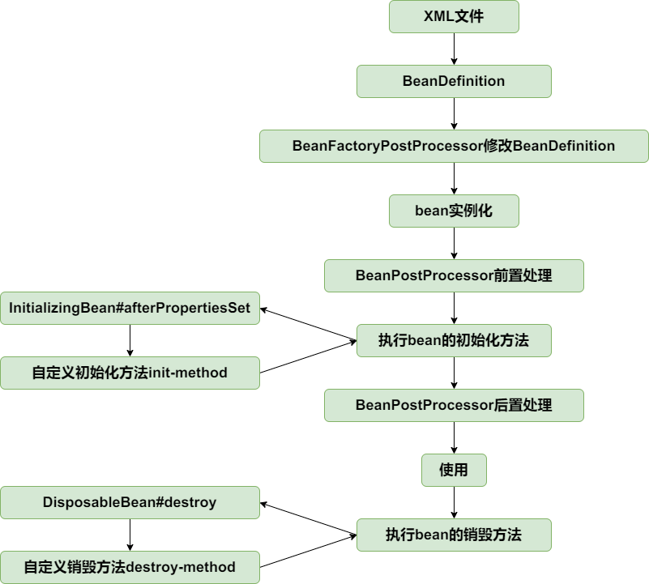


这个方法我们就补全了

```java
protected void invokeInitMethods(String beanName, Object bean, BeanDefinition beanDefinition) throws Throwable {  
    // 1. 检查bean是否实现了InitializingBean接口，并执行其afterPropertiesSet方法  
    // InitializingBean 是Spring提供的一个回调接口，允许bean在所有属性设置完成后执行自定义初始化。  
    if (bean instanceof InitializingBean) {  
       ((InitializingBean) bean).afterPropertiesSet();  
    }  
  
    // 2. 获取bean定义中配置的初始化方法名称  
    String initMethodName = beanDefinition.getInitMethodName();  
  
    // 3. 检查是否存在用户自定义的初始化方法，并避免与InitializingBean的afterPropertiesSet重复调用  
    // StrUtil.isNotEmpty(initMethodName) 确保initMethodName不为空或null  
    // !(bean instanceof InitializingBean && "afterPropertiesSet".equals(initMethodName)) 避免  
    // 当bean既实现了InitializingBean又在XML中将init-method指定为"afterPropertiesSet"时，重复调用。  
    if (StrUtil.isNotEmpty(initMethodName) && !(bean instanceof InitializingBean && "afterPropertiesSet".equals(initMethodName))) {  
       // 通过反射获取公共的初始化方法  
       Method initMethod = ClassUtil.getPublicMethod(beanDefinition.getBeanClass(), initMethodName);  
       // 如果找不到指定的初始化方法，抛出异常  
       if (initMethod == null) {  
          throw new BeansException("Could not find an init method named '" + initMethodName + "' on bean with name '" + beanName + "'");  
       }  
       // 调用用户自定义的初始化方法  
       initMethod.invoke(bean);  
    }  
}
```

目前 `XMLBeanDefinitionReade` 也多了两个字段，`init-method`和`destory-method`

现在会注册有摧毁方法的bean
```java
protected Object doCreateBean(String beanName, BeanDefinition beanDefinition) {  
    Object bean = null;  
    try {  
       bean = createBeanInstance(beanDefinition);  
       //为bean填充属性  
       applyPropertyValues(beanName, bean, beanDefinition);  
       //执行bean的初始化方法和BeanPostProcessor的前置和后置处理方法  
       initializeBean(beanName, bean, beanDefinition);  
    } catch (Exception e) {  
       throw new BeansException("Instantiation of bean failed", e);  
    }  
  
    //注册有销毁方法的bean  
    registerDisposableBeanIfNecessary(beanName, bean, beanDefinition);  
  
    addSingleton(beanName, bean);  
    return bean;  
}
```

```java
public abstract class AbstractApplicationContext extends DefaultResourceLoader implements ConfigurableApplicationContext {  
    public void close() {  
       doClose();  
    }  
  
    public void registerShutdownHook() {  
       Thread shutdownHook = new Thread() {  
          public void run() {  
             doClose();  
          }  
       };  
       Runtime.getRuntime().addShutdownHook(shutdownHook);  
  
    }  
  
    protected void doClose() {  
       destroyBeans();  
    }  
  
    protected void destroyBeans() {  
       getBeanFactory().destroySingletons();  
    }  
}
```

```java
private final Map<String, DisposableBean> disposableBeans = new HashMap<>();

public void destroySingletons() {  
    ArrayList<String> beanNames = new ArrayList<>(disposableBeans.keySet());  
    for (String beanName : beanNames) {  
       DisposableBean disposableBean = disposableBeans.remove(beanName);  
       try {  
          disposableBean.destroy();  
       } catch (Exception e) {  
          throw new BeansException("Destroy method on bean with name '" + beanName + "' threw an exception", e);  
       }  
    }  
}
```

这个就是存的销毁Bean包装类
```java
public class DisposableBeanAdapter implements DisposableBean {  
  
    private final Object bean;  
  
    private final String beanName;  
  
    private final String destroyMethodName;  
  
    public DisposableBeanAdapter(Object bean, String beanName, BeanDefinition beanDefinition) {  
       this.bean = bean;  
       this.beanName = beanName;  
       this.destroyMethodName = beanDefinition.getDestroyMethodName();  
    }  
  
    @Override  
    public void destroy() throws Exception {  
       if (bean instanceof DisposableBean) {  
          ((DisposableBean) bean).destroy();  
       }  
  
       //避免同时继承自DisposableBean，且自定义方法与DisposableBean方法同名，销毁方法执行两次的情况  
       if (StrUtil.isNotEmpty(destroyMethodName) && !(bean instanceof DisposableBean && "destroy".equals(this.destroyMethodName))) {  
          //执行自定义方法  
          Method destroyMethod = ClassUtil.getPublicMethod(bean.getClass(), destroyMethodName);  
          if (destroyMethod == null) {  
             throw new BeansException("Couldn't find a destroy method named '" + destroyMethodName + "' on bean with name '" + beanName + "'");  
          }  
          destroyMethod.invoke(bean);  
       }  
    }  
}
```

你可能问为什么只`DisposableBean disposableBean = disposableBeans.remove(beanName);  `但是不去移除单例表呢

在 Spring 容器关闭时，`destroySingletons()` 方法的核心职责是**优雅地处理那些需要自定义清理逻辑的 Bean**，而不是简单地清空所有 Bean 实例的引用。理解这一点，需要区分 Spring 的“销毁”行为与 JVM 的“垃圾回收”机制。

1. `disposableBeans`：自定义清理的“责任清单”

- **存储的是“有责任”的 Bean**：`disposableBeans` 映射表（通常是一个 `Map<String, DisposableBean>`）中，只存储那些**实现了 `DisposableBean` 接口或在 Bean 定义中通过 `destroy-method` 属性指定了销毁方法的单例 Bean**。这些 Bean 通常持有外部资源，比如数据库连接池、文件句柄、网络套接字、自定义线程池等等。它们在被销毁前，需要执行特定的代码来释放这些资源，否则可能导致资源泄露、数据不一致或系统僵死。

- **确保“善后”工作被执行**：`destroySingletons()` 方法遍历 `disposableBeans` 的目的，就是逐一调用这些 Bean 预定义的销毁逻辑 (`disposableBean.destroy()` 或反射调用 `destroy-method`)。这是 Spring 容器对所管理资源的一种**主动的、有保障的释放行为**。

- **为什么“移除”它？** `DisposableBean disposableBean = disposableBeans.remove(beanName);` 这行代码做了两件事：

    1. **获取待销毁的 `DisposableBean` 实例。**

    2. **立即从 `disposableBeans` Map 中移除该条目。** 这样做是为了**避免重复销毁**（如果销毁流程出现异常或被再次触发）以及**标记该 Bean 已被处理**。一旦某个 Bean 的销毁方法被调用，它就不再是“待销毁”清单上的一员了。这个移除操作是为了维护 `disposableBeans` 集合的正确状态和流程的健壮性。


2. `singletonObjects`：JVM 垃圾回收的“地盘”

- **存储所有单例 Bean 实例**：`singletonObjects` 映射表（通常是 `Map<String, Object>`）中，存储的是**所有已实例化并完成初始化的单例 Bean 实例**，无论它们是否需要自定义销毁逻辑。它代表了容器当前“活着”的所有单例 Bean。

- **依赖 JVM 垃圾回收**：Spring 容器本身就是一个 Java 对象。当应用程序关闭，并且不再有任何代码持有对 `ApplicationContext` 实例的引用时，`ApplicationContext` 实例本身就成了垃圾。只要 `ApplicationContext` 实例本身是“活着”的（即它没有被垃圾回收），那么它内部的 `singletonObjects` Map 就活着，Map 里面所有的键值对也就活着，它们持有的 Bean 实例也就被强引用着。

    - 因为 `singletonObjects` 是 `ApplicationContext` 实例的一个内部字段，当 `ApplicationContext` 实例变得不可达时，`singletonObjects` 这个 `Map` 对象也会变得不可达。

    - 随之，`singletonObjects` Map 中存储的**所有对 Bean 实例的引用**也会变得不可达。

    - 此时，JVM 的**垃圾回收器**就会介入，自动识别并回收这些不再被任何强引用所持有的 Bean 实例所占用的内存空间。JVM 的垃圾回收机制会处理内存的自动释放，这是 Java 语言的核心特性。

- **没有必要显式清空**：因此，Spring 没有必要在 `destroySingletons()` 中去显式地遍历 `singletonObjects` 并将其清空。这样做并不会加快内存的回收速度，因为内存回收的决定性因素是对象是否被引用，而不是它是否还在某个 Map 中。显式清空反而会增加不必要的计算开销。


测试：
init-and-destroy-method.xml
```xml
<?xml version="1.0" encoding="UTF-8"?>
<beans xmlns="http://www.springframework.org/schema/beans"
       xmlns:xsi="http://www.w3.org/2001/XMLSchema-instance"
       xmlns:context="http://www.springframework.org/schema/context"
       xsi:schemaLocation="http://www.springframework.org/schema/beans
	         http://www.springframework.org/schema/beans/spring-beans.xsd
		 http://www.springframework.org/schema/context
		 http://www.springframework.org/schema/context/spring-context-4.0.xsd">

    <bean id="person" class="org.springframework.test.bean.Person" init-method="customInitMethod" destroy-method="customDestroyMethod">
        <property name="name" value="derek"/>
        <property name="car" ref="car"/>
    </bean>

    <bean id="car" class="org.springframework.test.bean.Car">
        <property name="brand" value="porsche"/>
    </bean>

</beans>
```

```java
public class Person implements InitializingBean, DisposableBean {

	private String name;

	private int age;

	private Car car;

	public void customInitMethod() {
		System.out.println("I was born in the method named customInitMethod");
	}

	public void customDestroyMethod() {
		System.out.println("I died in the method named customDestroyMethod");
	}

	@Override
	public void afterPropertiesSet() throws Exception {
		System.out.println("I was born in the method named afterPropertiesSet");
	}

	@Override
	public void destroy() throws Exception {
		System.out.println("I died in the method named destroy");
	}

    //setter and getter
}
```

```java
public class InitAndDestoryMethodTest {

	@Test
	public void testInitAndDestroyMethod() throws Exception {
		ClassPathXmlApplicationContext applicationContext = new ClassPathXmlApplicationContext("classpath:init-and-destroy-method.xml");
		applicationContext.registerShutdownHook();  //或者手动关闭 applicationContext.close();
	}
}
```

注意目前是销毁所有的注册了的销毁Bean

## Aware接口

> 代码分支：aware-interface

Aware是感知、意识的意思，Aware接口是标记性接口，其实现子类能感知容器相关的对象。常用的Aware接口有BeanFactoryAware和ApplicationContextAware，分别能让其实现者感知所属的BeanFactory和ApplicationContext。

让实现BeanFactoryAware接口的类能感知所属的BeanFactory，实现比较简单，查看AbstractAutowireCapableBeanFactory#initializeBean前三行。

实现ApplicationContextAware的接口感知ApplicationContext，是通过BeanPostProcessor。由bean的生命周期可知，bean实例化后会经过BeanPostProcessor的前置处理和后置处理。定义一个BeanPostProcessor的实现类ApplicationContextAwareProcessor，在AbstractApplicationContext#refresh方法中加入到BeanFactory中，在前置处理中为bean设置所属的ApplicationContext。


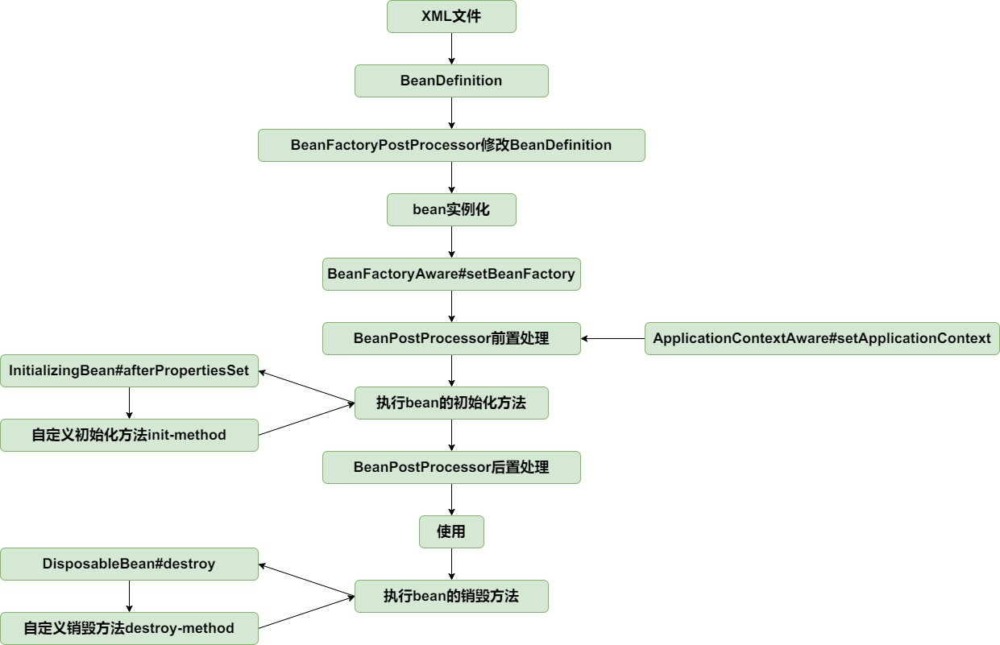


```JAVA
protected Object initializeBean(String beanName, Object bean, BeanDefinition beanDefinition) {  
    if (bean instanceof BeanFactoryAware) {  
       ((BeanFactoryAware) bean).setBeanFactory(this);  
    }  
  
    //执行BeanPostProcessor的前置处理  
    Object wrappedBean = applyBeanPostProcessorsBeforeInitialization(bean, beanName);  
  
    try {  
       invokeInitMethods(beanName, wrappedBean, beanDefinition);  
    } catch (Throwable ex) {  
       throw new BeansException("Invocation of init method of bean[" + beanName + "] failed", ex);  
    }  
  
    //执行BeanPostProcessor的后置处理  
    wrappedBean = applyBeanPostProcessorsAfterInitialization(bean, beanName);  
    return wrappedBean;  
}
```

```JAVA
public class ApplicationContextAwareProcessor implements BeanPostProcessor {  
  
    private final ApplicationContext applicationContext;  
  
    public ApplicationContextAwareProcessor(ApplicationContext applicationContext) {  
       this.applicationContext = applicationContext;  
    }  
  
    @Override  
    public Object postProcessBeforeInitialization(Object bean, String beanName) throws BeansException {  
       if (bean instanceof ApplicationContextAware) {  
          ((ApplicationContextAware) bean).setApplicationContext(applicationContext);  
       }  
       return bean;  
    }  
  
    @Override  
    public Object postProcessAfterInitialization(Object bean, String beanName) throws BeansException {  
       return bean;  
    }  
}
```

```java
@Override  
public void refresh() throws BeansException {  
    //创建BeanFactory，并加载BeanDefinition  
    refreshBeanFactory();  
    ConfigurableListableBeanFactory beanFactory = getBeanFactory();  
  
    //添加ApplicationContextAwareProcessor，让继承自ApplicationContextAware的bean能感知bean  
    beanFactory.addBeanPostProcessor(new ApplicationContextAwareProcessor(this));  
  
    //在bean实例化之前，执行BeanFactoryPostProcessor  
    invokeBeanFactoryPostProcessors(beanFactory);  
  
    //BeanPostProcessor需要提前与其他bean实例化之前注册  
    registerBeanPostProcessors(beanFactory);  
  
    //提前实例化单例bean  
    beanFactory.preInstantiateSingletons();  
}
```

**为什么 `ApplicationContextAwareProcessor` 必须提前添加？**

答案在于**保证核心的 Bean 能在早期感知到 `ApplicationContext`。**

思考一下：

- **`ApplicationContextAwareProcessor` 自身是一个 `BeanPostProcessor`。** 为了让它能发挥作用，它必须在其他 Bean 实例化之前**先被注册到 `BeanFactory` 中**。

- **一些重要的 Bean（包括某些 `BeanPostProcessor` 和 `BeanFactoryPostProcessor` 自身）可能需要感知 `ApplicationContext`。**

    - 例如，假设你有一个自定义的 `BeanPostProcessor`，它自己也实现了 `ApplicationContextAware`。如果 `ApplicationContextAwareProcessor` 没有在它之前被注册，那么这个自定义的 `BeanPostProcessor` 在被实例化和处理时，就无法通过 `ApplicationContextAware` 机制获取到 `ApplicationContext`。

    - 更重要的是，**`invokeBeanFactoryPostProcessors(beanFactory)` 和 `registerBeanPostProcessors(beanFactory)` 这两个方法本身就需要获取并实例化容器中的 `BeanFactoryPostProcessor` 和 `BeanPostProcessor`。** 如果这些后处理器本身就需要 `ApplicationContext`，那么 `ApplicationContextAwareProcessor` 必须在它们被完全初始化并发挥作用前就位。


测试：
spring.xml
```xml
<?xml version="1.0" encoding="UTF-8"?>
<beans xmlns="http://www.springframework.org/schema/beans"
       xmlns:xsi="http://www.w3.org/2001/XMLSchema-instance"
       xmlns:context="http://www.springframework.org/schema/context"
       xsi:schemaLocation="http://www.springframework.org/schema/beans
	         http://www.springframework.org/schema/beans/spring-beans.xsd
		 http://www.springframework.org/schema/context
		 http://www.springframework.org/schema/context/spring-context-4.0.xsd">

    <bean id="helloService" class="org.springframework.test.service.HelloService"/>

</beans>
```

```java
public class HelloService implements ApplicationContextAware, BeanFactoryAware {

	private ApplicationContext applicationContext;

	private BeanFactory beanFactory;

	@Override
	public void setBeanFactory(BeanFactory beanFactory) throws BeansException {
		this.beanFactory = beanFactory;
	}

	@Override
	public void setApplicationContext(ApplicationContext applicationContext) throws BeansException {
		this.applicationContext = applicationContext;
	}

	public ApplicationContext getApplicationContext() {
		return applicationContext;
	}

	public BeanFactory getBeanFactory() {
		return beanFactory;
	}
}
```

```java
public class AwareInterfaceTest {

	@Test
	public void test() throws Exception {
		ClassPathXmlApplicationContext applicationContext = new ClassPathXmlApplicationContext("classpath:spring.xml");
		HelloService helloService = applicationContext.getBean("helloService", HelloService.class);
		assertThat(helloService.getApplicationContext()).isNotNull();
		assertThat(helloService.getBeanFactory()).isNotNull();
	}
}
```

## bean作用域，增加prototype的支持

> 代码分支：prototype-bean

每次向容器获取prototype作用域bean时，容器都会创建一个新的实例。在BeanDefinition中增加描述bean的作用域的字段scope，创建prototype作用域bean时（AbstractAutowireCapableBeanFactory#doCreateBean），不往singletonObjects中增加该bean。prototype作用域bean不执行销毁方法，查看AbstractAutowireCapableBeanFactory#registerDisposableBeanIfNecessary方法。

至止，bean的生命周期如下：

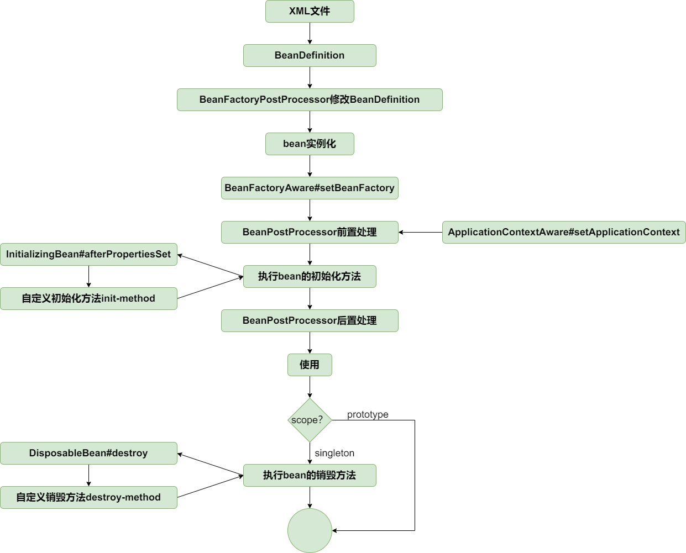


`XmlBeanDefinitionReader`多了一个`scope`字段

```java
public class BeanDefinition {  
      
    // 单例作用域的常量标识  
    public static String SCOPE_SINGLETON = "singleton";  
      
    // 原型作用域的常量标识  
    public static String SCOPE_PROTOTYPE = "prototype";  
      
    // Bean 的 Class 类型，表示该 Bean 实际对应的类  
    private Class beanClass;  
      
    // Bean 的属性值集合，用于注入依赖属性  
    private PropertyValues propertyValues;  
      
    // Bean 的初始化方法名（可选）  
    private String initMethodName;  
      
    // Bean 的销毁方法名（可选）  
    private String destroyMethodName;  
      
    // Bean 的作用域，默认是单例 singleton   
     private String scope = SCOPE_SINGLETON;  
      
    // 是否是单例，默认 true   
     private boolean singleton = true;  
      
    // 是否是原型，默认 false    
    private boolean prototype = false;
}
```

```java
protected Object doCreateBean(String beanName, BeanDefinition beanDefinition) {  
    Object bean = null;  
    try {  
       bean = createBeanInstance(beanDefinition);  
       //为bean填充属性  
       applyPropertyValues(beanName, bean, beanDefinition);  
       //执行bean的初始化方法和BeanPostProcessor的前置和后置处理方法  
       initializeBean(beanName, bean, beanDefinition);  
    } catch (Exception e) {  
       throw new BeansException("Instantiation of bean failed", e);  
    }  
  
    //注册有销毁方法的bean  
    registerDisposableBeanIfNecessary(beanName, bean, beanDefinition);  
  
    if (beanDefinition.isSingleton()) {  
       addSingleton(beanName, bean);  
    }  
    return bean;  
}
```


```java
protected void registerDisposableBeanIfNecessary(String beanName, Object bean, BeanDefinition beanDefinition) {  
    //只有singleton类型bean会执行销毁方法  ，注册到销毁表中
    if (beanDefinition.isSingleton()) {  
       if (bean instanceof DisposableBean || StrUtil.isNotEmpty(beanDefinition.getDestroyMethodName())) {  
          registerDisposableBean(beanName, new DisposableBeanAdapter(bean, beanName, beanDefinition));  
       }  
    }  
}
```

这里就不和以前一样，要是单例的才能实例化
```java
@Override  
public void preInstantiateSingletons() throws BeansException {  
    beanDefinitionMap.forEach((beanName, beanDefinition) -> {  
       if(beanDefinition.isSingleton()){  
          getBean(beanName);  
       }  
    });  
}
```

测试：
prototype-bean.xml
```xml
<?xml version="1.0" encoding="UTF-8"?>
<beans xmlns="http://www.springframework.org/schema/beans"
       xmlns:xsi="http://www.w3.org/2001/XMLSchema-instance"
       xmlns:context="http://www.springframework.org/schema/context"
       xsi:schemaLocation="http://www.springframework.org/schema/beans
	         http://www.springframework.org/schema/beans/spring-beans.xsd
		 http://www.springframework.org/schema/context
		 http://www.springframework.org/schema/context/spring-context-4.0.xsd">

    <bean id="car" class="org.springframework.test.bean.Car" scope="prototype">
        <property name="brand" value="porsche"/>
    </bean>

</beans>
```

```java
public class PrototypeBeanTest {

	@Test
	public void testPrototype() throws Exception {
		ClassPathXmlApplicationContext applicationContext = new ClassPathXmlApplicationContext("classpath:prototype-bean.xml");

		Car car1 = applicationContext.getBean("car", Car.class);
		Car car2 = applicationContext.getBean("car", Car.class);
		assertThat(car1 != car2).isTrue();
	}
}
```

## FactoryBean

> 代码分支：factory-bean


FactoryBean是一种特殊的bean，当向容器获取该bean时，容器不是返回其本身，而是返回其FactoryBean#getObject方法的返回值，可通过编码方式定义复杂的bean。

- **封装复杂对象的创建逻辑**：有些 Bean 的创建过程可能非常复杂，比如：

    - 需要通过一套复杂的算法或多步操作才能构造出来。

    - 需要根据不同的条件返回不同类型的实例。

    - 需要集成第三方库的对象，而这些对象的构造函数可能不符合 Spring 的直接注入规则。

    - 需要代理对象或某种装饰器对象。

- **将 Bean 的创建逻辑抽象出来**：通过 `FactoryBean`，你可以将这种复杂的创建逻辑封装在一个单独的类中，这个类本身就是 Spring 管理的一个 Bean。

- **透明化**：对于使用者来说，你依然像获取普通 Bean 一样通过 `getBean("myComplexBean")` 来获取它，但实际上 Spring 会在幕后调用 `FactoryBean` 的 `getObject()` 方法来获取最终的产品 Bean。

实现逻辑比较简单，当容器发现bean为FactoryBean类型时，调用其getObject方法返回最终bean。当FactoryBean#isSingleton`==`true，将最终bean放进缓存中，下次从缓存中获取。改动点见AbstractBeanFactory#getBean。

```java
public abstract class AbstractBeanFactory extends DefaultSingletonBeanRegistry implements ConfigurableBeanFactory {  
  
    private final List<BeanPostProcessor> beanPostProcessors = new ArrayList<>();  
  
    private final Map<String, Object> factoryBeanObjectCache = new HashMap<>();  
  
    @Override  
    public Object getBean(String name) throws BeansException {  
       Object sharedInstance = getSingleton(name);  
       if (sharedInstance != null) {  
          //如果是FactoryBean，从FactoryBean#getObject中创建bean  
          return getObjectForBeanInstance(sharedInstance, name);  
       }  
  
       BeanDefinition beanDefinition = getBeanDefinition(name);  
       Object bean = createBean(name, beanDefinition);  
       return getObjectForBeanInstance(bean, name);  
    }  
  
    /**  
     * 如果是FactoryBean，从FactoryBean#getObject中创建bean  
     *     * @param beanInstance  
     * @param beanName  
     * @return  
     */  
    protected Object getObjectForBeanInstance(Object beanInstance, String beanName) {  
       Object object = beanInstance;  
       if (beanInstance instanceof FactoryBean) {  
          FactoryBean factoryBean = (FactoryBean) beanInstance;  
          try {  
             if (factoryBean.isSingleton()) {  
                //singleton作用域bean，从缓存中获取  
                object = this.factoryBeanObjectCache.get(beanName);  
                if (object == null) {  
                   object = factoryBean.getObject();  
                   this.factoryBeanObjectCache.put(beanName, object);  
                }  
             } else {  
                //prototype作用域bean，新创建bean  
                object = factoryBean.getObject();  
             }  
          } catch (Exception ex) {  
             throw new BeansException("FactoryBean threw exception on object[" + beanName + "] creation", ex);  
          }  
       }  
  
       return object;  
    }
}
```
以前的实现
```java
@Override  
public Object getBean(String name) throws BeansException {  
    Object bean = getSingleton(name);  
    if (bean != null) {  
       return bean;  
    }  
  
    BeanDefinition beanDefinition = getBeanDefinition(name);  
    return createBean(name, beanDefinition);  
}
```

测试：
factory-bean.xml
```xml
<?xml version="1.0" encoding="UTF-8"?>
<beans xmlns="http://www.springframework.org/schema/beans"
       xmlns:xsi="http://www.w3.org/2001/XMLSchema-instance"
       xmlns:context="http://www.springframework.org/schema/context"
       xsi:schemaLocation="http://www.springframework.org/schema/beans
	         http://www.springframework.org/schema/beans/spring-beans.xsd
		 http://www.springframework.org/schema/context
		 http://www.springframework.org/schema/context/spring-context-4.0.xsd">

    <bean id="car" class="org.springframework.test.common.CarFactoryBean">
        <property name="brand" value="porsche"/>
    </bean>

</beans>
```

```java
public class CarFactoryBean implements FactoryBean<Car> {

	private String brand;

	@Override
	public Car getObject() throws Exception {
		Car car = new Car();
		car.setBrand(brand);
		return car;
	}

	@Override
	public boolean isSingleton() {
		return true;
	}

	public void setBrand(String brand) {
		this.brand = brand;
	}
}
```

```java
public class FactoryBeanTest {

	@Test
	public void testFactoryBean() throws Exception {
		ClassPathXmlApplicationContext applicationContext = new ClassPathXmlApplicationContext("classpath:factory-bean.xml");

		Car car = applicationContext.getBean("car", Car.class);
		applicationContext.getBean("car");
		assertThat(car.getBrand()).isEqualTo("porsche");
	}
}
```

## [容器事件和事件监听器](#容器事件和事件监听器)

#### 大致会经历以下步骤：

1. **尝试从单例缓存中获取 Bean 实例 (`getSingleton(name)`)**

    - **代码**：`Object sharedInstance = getSingleton(name);`

    - **目的**：这是获取 Bean 的第一道防线，也是性能优化的关键。Spring IoC 容器默认所有 Bean 都是单例的，并且会缓存已创建的单例 Bean 实例。

    - **逻辑**：`getSingleton()` 方法会尝试从 `DefaultSingletonBeanRegistry`（`AbstractBeanFactory` 的父类）维护的 `singletonObjects` 缓存中，根据 `name` 查找对应的 Bean 实例。

    - **结果判断**：

        - **如果 `sharedInstance` 不为 `null` (即 Bean 实例已存在于单例缓存中)**：说明这个 Bean 之前已经被创建过并且是单例的。流程会直接进入步骤 2.1，去处理这个已存在的实例。

        - **如果 `sharedInstance` 为 `null` (即 Bean 实例不在单例缓存中)**：说明这个 Bean 是第一次被请求，或者它是一个非单例 Bean（例如原型 Bean），或者它还未被创建。流程将继续到步骤 3，去创建这个 Bean。

2. **处理已存在的 Bean 实例（`sharedInstance != null` 的分支）**

    - **代码**：`return getObjectForBeanInstance(sharedInstance, name);`

    - **目的**：如果从单例缓存中找到了 Bean 实例，还需要判断这个实例本身是不是一个 `FactoryBean`。

    - **具体流程（进入 `getObjectForBeanInstance` 方法）**：

        - **检查是否是 `FactoryBean`**：`if (beanInstance instanceof FactoryBean)`

            - **如果 `sharedInstance` 是 `FactoryBean`**：

                - **再次检查 `FactoryBean` 是否是单例**：`if (factoryBean.isSingleton())`

                    - **如果是单例 `FactoryBean`**：

                        - **尝试从 `factoryBeanObjectCache` 中获取其产品对象**：`object = this.factoryBeanObjectCache.get(beanName);`

                            - 这个 `factoryBeanObjectCache` 是专门用来缓存 `FactoryBean` 生产出的单例产品的。

                            - **如果产品对象已存在**：直接返回缓存中的产品对象。

                            - **如果产品对象不存在**：

                                - 调用 `factoryBean.getObject()` 来**创建（生产）**实际的 Bean 实例（产品）。

                                - 将这个产品对象**放入 `factoryBeanObjectCache` 中**进行缓存。

                                - 返回这个产品对象。

                    - **如果是非单例 `FactoryBean`** (`factoryBean.isSingleton()` 为 `false`)：

                        - 每次都会调用 `factoryBean.getObject()` 来**创建新的产品对象**。

                        - **不会缓存**产品对象。

                        - 返回这个新创建的产品对象。

                - **异常处理**：`try...catch` 块捕获 `factoryBean.getObject()` 可能抛出的异常，并包装成 `BeansException`。

            - **如果 `sharedInstance` 不是 `FactoryBean`**：

                - 这说明它是一个普通的 Bean 实例。

                - 直接返回 `sharedInstance` 本身。

3. **创建新的 Bean 实例（`sharedInstance == null` 的分支）**

    - **代码**：


        ```java
        BeanDefinition beanDefinition = getBeanDefinition(name);
        Object bean = createBean(name, beanDefinition);
        return getObjectForBeanInstance(bean, name);
        ```
        
    - **目的**：当缓存中没有 Bean 实例时，需要根据 Bean 定义来创建它。
        
    - **具体流程**：
        
        - **获取 `BeanDefinition`**：`getBeanDefinition(name)` 会从 `BeanFactory` 内部存储的 Bean 定义注册表中获取指定 `name` 的 `BeanDefinition`。这个 `BeanDefinition` 包含了 Bean 的所有元数据，如类名、构造函数参数、属性值、作用域等。
            
        - **创建 Bean 实例 (`createBean(name, beanDefinition)`)**：
            
            - 这是一个抽象方法，在子类中（如 `AbstractAutowireCapableBeanFactory`）会实现具体的 Bean 创建和初始化逻辑。
                
            - 这个阶段会进行 Bean 的实例化（通过构造函数）、属性填充（依赖注入）、以及执行各种 `BeanPostProcessor` 的前置和后置处理、`init-method` 等初始化步骤。
                
            - 如果这个 Bean 是单例的，它也会在 `createBean` 内部的某个阶段被添加到 `DefaultSingletonBeanRegistry` 的 `singletonObjects` 缓存中。
                
        - **处理新创建的 Bean 实例（再次调用 `getObjectForBeanInstance`）**：
            
            - **代码**：`return getObjectForBeanInstance(bean, name);`
                
            - **目的**：新创建的 `bean` 实例同样需要经过 `FactoryBean` 的判断和处理。
                
            - **具体逻辑与步骤 2.1 相同**：
                
                - 如果新创建的 `bean` 本身是一个 `FactoryBean`，那么会按照 `FactoryBean` 的逻辑（单例缓存或每次新建）返回其生产出的产品对象。
                    
                - 如果新创建的 `bean` 是一个普通 Bean，则直接返回这个 Bean 本身。


## 容器事件和事件监听器

> 代码分支：event-and-event-listener

ApplicationContext容器提供了完善的事件发布和事件监听功能。

ApplicationEventMulticaster接口是注册监听器和发布事件的抽象接口，AbstractApplicationContext包含其实现类实例作为其属性，使得ApplicationContext容器具有注册监听器和发布事件的能力。在AbstractApplicationContext#refresh方法中，会实例化ApplicationEventMulticaster、注册监听器并发布容器刷新事件ContextRefreshedEvent；在AbstractApplicationContext#doClose方法中，发布容器关闭事件ContextClosedEvent。

### 来仔细看一下流程

1. `ApplicationEvent` (报纸)
- **作用**：它是 Spring 事件体系的**基石**，代表了在应用程序中发生的**任何事件**。就像所有的报纸都有一个共同的“报纸”的概念一样。

- **`source`**：事件的来源对象。比如，某个 Bean 发布了一个事件，那这个 Bean 就是 `source`。就像报纸通常会标注它的发行单位一样。

- **你的自定义事件**：如果你要发布一个“用户注册成功”事件，你就需要创建一个类 `UserRegisteredEvent extends ApplicationEvent`。
```java
public abstract class ApplicationEvent extends EventObject {  
      
    public ApplicationEvent(Object source){  
        super(source);  
    }  
}
```

2. `ApplicationContextEvent` (特殊报纸：容器生命周期报纸)
- **作用**：这是 `ApplicationEvent` 的一个子类，专门用于表示与 **Spring `ApplicationContext` 容器自身生命周期相关的事件**。

- **特殊性**：它的 `source` 总是 `ApplicationContext` 实例本身。因为它关注的是容器自身的状态变化（比如容器启动、关闭）。

- **例子**：`ContextRefreshedEvent` (容器刷新完成事件)、`ContextClosedEvent` (容器关闭事件) 都继承自它。它们是容器自己“发行”的“特殊报纸”，通知订户容器状态的变化。
```java
public abstract class ApplicationContextEvent extends ApplicationEvent {
    public ApplicationContextEvent(ApplicationContext source) {
        super(source);
    }
    public final ApplicationContext getApplicationContext() {
        return (ApplicationContext) getSource();
    }
}
```

3. `ApplicationEventPublisher` (报社 / 事件发布者)
- **作用**：这是一个**接口**，定义了**发布事件**的能力。任何实现了这个接口的对象，都可以把一个 `ApplicationEvent` “扔出去”。

- **实现者**：`ApplicationContext` 自身就实现了这个接口。所以，你可以直接通过 `applicationContext.publishEvent(new CustomEvent(...))` 来发布事件。这就像你把新出版的报纸交给了“报亭/发行中心”。
```java
public interface ApplicationEventPublisher {
    void publishEvent(ApplicationEvent event);
}
```

4. `ApplicationListener` (订户 / 事件监听器)
- **作用**：这是一个**接口**，定义了**监听和处理事件**的能力。任何实现了这个接口的 Bean，都可以成为一个“订户”。

- **泛型 `<E extends ApplicationEvent>`**：这是非常关键的一点。它表示这个监听器只对特定类型的事件 `E` 感兴趣。

    - 例如：`ApplicationListener<ContextRefreshedEvent>` 表示只监听容器刷新事件。

    - `ApplicationListener<CustomEvent>` 表示只监听你的自定义事件。

- **`onApplicationEvent(E event)`**：这是监听器收到事件后，执行具体业务逻辑的方法。就像订户拿到报纸后，阅读报纸内容一样。
```java
public interface ApplicationListener<E extends ApplicationEvent> extends EventListener {
    void onApplicationEvent(E event);
}
```

5. `AbstractApplicationEventMulticaster` (报亭/发行中心 - 抽象骨架)
- **作用**：它是**事件广播器**的抽象基类，负责**管理所有注册的监听器**（`applicationListeners` 集合），并在事件发布时，将事件“广播”给相关的监听器。

- **`BeanFactoryAware`**：为什么它要实现这个接口？因为在实际的 Spring 场景中，`ApplicationListener` 自身也是 Bean。`ApplicationEventMulticaster` 可能需要 `BeanFactory` 来辅助查找和处理这些监听器 Bean 的一些细节（例如，通过 `BeanFactory` 来获取一些辅助 Bean）。
```java
public abstract class AbstractApplicationEventMulticaster implements ApplicationEventMulticaster, BeanFactoryAware {
    public final Set<ApplicationListener<ApplicationEvent>> applicationListeners = new HashSet<>();
    private BeanFactory beanFactory; // 它自己需要感知到 BeanFactory，以便后续处理监听器

    @Override
    public void addApplicationListener(ApplicationListener<?> listener) {
        // 将监听器添加到集合中
        applicationListeners.add((ApplicationListener<ApplicationEvent>) listener);
    }

    @Override
    public void removeApplicationListener(ApplicationListener<?> listener) {
        // 从集合中移除监听器
        applicationListeners.remove(listener);
    }

    @Override
    public void setBeanFactory(BeanFactory beanFactory) throws BeansException {
        // 它自己实现了 BeanFactoryAware，所以 Spring 会注入 BeanFactory
        this.beanFactory = beanFactory;
    }
}
```

6. `SimpleApplicationEventMulticaster` (报亭/发行中心 - 具体实现)
- **作用**：这是 `ApplicationEventMulticaster` 的**默认实现类**。它负责在 `multicastEvent()` 方法中，遍历所有已注册的监听器，并通过 `supportsEvent()` 方法判断哪个监听器对当前事件感兴趣，然后只把事件分发给这些感兴趣的监听器。

- **`multicastEvent()`**：这是分发事件的核心逻辑。

- **`supportsEvent()`**：这个方法非常重要！它利用**泛型反射**机制，动态地判断一个 `ApplicationListener` 实例声明它想监听的事件类型 (`<E extends ApplicationEvent>`) 是否与当前要发布的事件类型兼容。

    - 例如，如果一个监听器是 `ApplicationListener<OrderCreateEvent>`，那么当发布一个 `OrderCreateEvent` 或其子类事件时，`supportsEvent` 会返回 `true`。但如果发布的是 `UserLoginEvent`，它就会返回 `false`。这确保了事件的精确分发。
```java
public class SimpleApplicationEventMulticaster extends AbstractApplicationEventMulticaster{

    @Override
    public void multicastEvent(ApplicationEvent event) {
        // 遍历所有已注册的监听器
        for (ApplicationListener<ApplicationEvent> applicationListener : applicationListeners) {
            // 判断当前监听器是否对这个事件感兴趣
            if (supportsEvent(applicationListener, event)) {
                // 如果感兴趣，就调用它的事件处理方法
                applicationListener.onApplicationEvent(event);
            }
        }
    }

    public SimpleApplicationEventMulticaster(BeanFactory beanFactory) {
        // 构造时，将 BeanFactory 注入给自己
        setBeanFactory(beanFactory);
    }

    /**
     * 判断一个监听器是否对该事件感兴趣（是否支持处理这个事件）
     * （这个方法很关键，它决定了事件是否会被分发给某个监听器）
     *
     * @param applicationListener 监听器（实现了 ApplicationListener 接口）
     * @param event               当前要发布的事件
     * @return                    是否支持（true 表示监听器支持这个事件类型）
     */
    protected boolean supportsEvent(ApplicationListener<ApplicationEvent> applicationListener, ApplicationEvent event){
        // 获取监听器类实现的 ApplicationListener 接口的泛型信息。
        // 例如：对于 MyListener implements ApplicationListener<MyEvent>，这里会拿到 `ApplicationListener<MyEvent>`
        Type type = applicationListener.getClass().getGenericInterfaces()[0];

        // 拿到这个接口的第一个泛型参数，也就是监听器声明感兴趣的事件类型。
        // 例如：从 `ApplicationListener<MyEvent>` 中拿到 `MyEvent` 的 Type 对象
        Type actualTypeArgument = ((ParameterizedType) type).getActualTypeArguments()[0];

        // 获取泛型参数对应的全类名字符串 (如 "com.example.MyEvent")
        String className = actualTypeArgument.getTypeName();

        Class<?> eventClassName;
        try {
            // 通过反射，将类名字符串转换成实际的 Class 对象 (如 MyEvent.class)
            eventClassName = Class.forName(className);
        } catch (ClassNotFoundException e) {
            // 如果类名不对，就抛异常
            throw new BeansException("wrong event class name: " + className);
        }

        // 核心判断逻辑：
        // 判断当前要发布的事件 `event` 的实际类型 (event.getClass())
        // 是否是监听器声明感兴趣的事件类型 (eventClassName) 的子类或本身。
        // 换句话说，如果监听器期望 MyEvent，那么 MyEvent 或 MyEvent 的子类都可以被它处理。
        return eventClassName.isAssignableFrom(event.getClass());
    }
}
```

```java
public abstract class AbstractApplicationContext extends DefaultResourceLoader implements ConfigurableApplicationContext {  
      
      
    public static final String APPLICATION_EVENT_MULTICASTER_BEAN_NAME = "applicationEventMulticaster";  
      
    private ApplicationEventMulticaster applicationEventMulticaster;  
      
    /**  
     * 初始化事件发布者  
     */  
    protected void initApplicationEventMulticaster() {  
        ConfigurableListableBeanFactory beanFactory = getBeanFactory();  
        applicationEventMulticaster = new SimpleApplicationEventMulticaster(beanFactory);  
        beanFactory.addSingleton(APPLICATION_EVENT_MULTICASTER_BEAN_NAME, applicationEventMulticaster);  
    }  
      
    @Override  
    public void refresh() throws BeansException {  
        //创建BeanFactory，并加载BeanDefinition  
        refreshBeanFactory();  
        ConfigurableListableBeanFactory beanFactory = getBeanFactory();  
          
        //添加ApplicationContextAwareProcessor，让继承自ApplicationContextAware的bean能感知bean  
        beanFactory.addBeanPostProcessor(new ApplicationContextAwareProcessor(this));  
          
        //在bean实例化之前，执行BeanFactoryPostProcessor  
        invokeBeanFactoryPostProcessors(beanFactory);  
          
        //BeanPostProcessor需要提前与其他bean实例化之前注册  
        registerBeanPostProcessors(beanFactory);  
          
        //初始化事件发布者  
        initApplicationEventMulticaster();  
          
        //注册事件监听器  
        registerListeners();  
          
        //提前实例化单例bean  
        beanFactory.preInstantiateSingletons();  
          
        //发布容器刷新完成事件  
        finishRefresh();  
    }  
      
    /**  
     * 注册事件监听器  
     */  
    protected void registerListeners() {  
        Collection<ApplicationListener> applicationListeners = getBeansOfType(ApplicationListener.class).values();  
        for (ApplicationListener applicationListener : applicationListeners) {  
            applicationEventMulticaster.addApplicationListener(applicationListener);  
        }  
    }  
      
    /**  
     * 发布容器刷新完成事件  
     */  
    protected void finishRefresh() {  
        publishEvent(new ContextRefreshedEvent(this));  
    }  
      
    @Override  
    public void publishEvent(ApplicationEvent event) {  
        applicationEventMulticaster.multicastEvent(event);  
    }  
    
    protected void doClose() {  
    //发布容器关闭事件  
    publishEvent(new ContextClosedEvent(this));  
    destroyBeans();  
	}
      
}
```

测试：
event-and-event-listener.xml
```xml
<?xml version="1.0" encoding="UTF-8"?>
<beans xmlns="http://www.springframework.org/schema/beans"
       xmlns:xsi="http://www.w3.org/2001/XMLSchema-instance"
       xmlns:context="http://www.springframework.org/schema/context"
       xsi:schemaLocation="http://www.springframework.org/schema/beans
	         http://www.springframework.org/schema/beans/spring-beans.xsd
		 http://www.springframework.org/schema/context
		 http://www.springframework.org/schema/context/spring-context-4.0.xsd">

    <bean class="org.springframework.test.common.event.ContextRefreshedEventListener"/>

    <bean class="org.springframework.test.common.event.CustomEventListener"/>

    <bean class="org.springframework.test.common.event.ContextClosedEventListener"/>
</beans>
```

```java
public class EventAndEventListenerTest {

	@Test
	public void testEventListener() throws Exception {
		ClassPathXmlApplicationContext applicationContext = new ClassPathXmlApplicationContext("classpath:event-and-event-listener.xml");
		applicationContext.publishEvent(new CustomEvent(applicationContext));

		applicationContext.registerShutdownHook();//或者applicationContext.close()主动关闭容器;
	}
}
```

观察输出：
第一个刷新完容器发布的，第二个是发布的，第三个销毁时候发布的
```
org.springframework.test.common.event.ContextRefreshedEventListener 
org.springframework.test.common.event.CustomEventListener
org.springframework.test.common.event.ContextClosedEventListener
```


Spring 的事件发布和监听功能，正是经典 **观察者模式 (Observer Pattern)** 的典型体现。

让我们来分析一下它如何符合观察者模式的定义和组成要素：

### 观察者模式的核心定义

**观察者模式 (Observer Pattern)** 是一种行为型设计模式，它定义了对象之间**一对多**的依赖关系，以便当一个对象（**主题/发布者**）的状态发生改变时，所有依赖它的对象（**观察者/订阅者/监听器**）都能够收到通知并自动更新。

### Spring 事件机制与观察者模式的对应关系

|观察者模式角色|Spring 事件机制对应|
|---|---|
|**主题 (Subject / Publisher)**|`ApplicationEventPublisher` 接口 (`ApplicationContext` 实现了它) 和 `ApplicationEventMulticaster`|
|**观察者 (Observer / Subscriber / Listener)**|`ApplicationListener` 接口|
|**事件 (Event)**|`ApplicationEvent` 及其子类|

**具体对应：**

1. **主题/发布者 (Subject / Publisher)**:

    - 在 Spring 中，`ApplicationContext` 充当了事件发布者的角色。它内部持有并委托给 `ApplicationEventMulticaster` 来管理监听器和实际发布事件。

    - 通过 `ApplicationContext` 的 `publishEvent()` 方法，任何 Bean 都可以发布事件。

2. **观察者/订阅者/监听器 (Observer / Subscriber / Listener)**:

    - 任何实现了 `ApplicationListener` 接口的 Bean 都充当了观察者的角色。它们对特定类型的事件感兴趣。

    - 当事件发生时，其 `onApplicationEvent()` 方法会被调用，从而执行相应的响应逻辑。

    - Spring 还提供了 `@EventListener` 注解，让开发者更方便地定义监听方法，而无需直接实现接口。

3. **事件 (Event)**:

    - `ApplicationEvent` 是所有 Spring 事件的抽象基类。它封装了事件发生时的上下文信息。

    - 具体的事件（如 `ContextRefreshedEvent`, `ContextClosedEvent` 或你的自定义事件）是具体的 `ApplicationEvent` 子类。


### 观察者模式的优点在 Spring 中的体现

- **松耦合 (Loose Coupling)**: 发布者和监听器之间没有直接依赖关系。发布者只需要知道它在发布一个 `ApplicationEvent`，而不需要知道有哪些监听器在监听它。监听器也只需要关注它感兴趣的事件，而不需要知道是谁发布的。这使得系统更加模块化，易于扩展和维护。

- **可扩展性 (Extensibility)**: 可以轻松地添加新的监听器来响应现有的事件，而无需修改发布者的代码。同样，可以发布新的事件类型，而不会影响现有的监听器（除非它们被修改以监听新事件）。

- **通知机制集中化**：`ApplicationEventMulticaster` 负责统一管理所有监听器和事件的分发，使得事件处理流程清晰。


因此，Spring 的事件发布和监听机制完美地诠释了**观察者模式**的核心思想和优势。


# AOP

## 切点表达式

> 代码分支：pointcut-expression

**Joinpoint (连接点)**

**Joinpoint** 指的是程序执行过程中，**可以插入切面逻辑的特定点**。

- 在此项目中，**Joinpoint** 特指“需要执行代理操作的某个类的某个方法”

- **Spring AOP** 默认主要支持**方法执行**的 Joinpoint。

-  **Spring AOP** 支持**更细粒度的连接点**，例如：

    - **字段访问**（读取或设置字段）。

    - **异常处理**（捕获或抛出异常）。

    - **对象实例化**（构造函数执行）。

    - 方法调用等。


---

**Pointcut (切入点)**

**Pointcut** 是 **Joinpoint 的表述方式**，它定义了**哪些 Joinpoint 应该被切面捕获和作用**。

- 一个 Pointcut 需要同时满足**类级别**和**方法级别**的匹配条件。

- **`ClassFilter` 接口**：用于定义**类级别**的匹配规则。它决定了哪些类是潜在的 Joinpoint 目标。

- **`MethodMatcher` 接口**：用于定义**方法级别**的匹配规则。它在 `ClassFilter` 筛选出的类中，进一步决定哪些方法是真正的 Joinpoint。

- **`Pointcut` 接口**：整合了 `ClassFilter` 和 `MethodMatcher`，确保切入点同时匹配类和方法。


---

**AspectJ 切点表达式**

**AspectJ 的切点表达式**是最常用且功能强大的切点定义方式。

- **`AspectJExpressionPointcut`** 是 Spring AOP 中支持 AspectJ 切点表达式的 `Pointcut` 实现类。

- 在这个“简单实现”中，仅支持 `execution` 函数来匹配方法的执行。

- 而 **Spring AOP**（通过集成 AspectJ Weaver）支持**更丰富的 AspectJ 切点表达式原语**，例如：

    - `@annotation()`：匹配带有特定注解的类或方法。

    - `args()`：匹配参数类型符合特定模式的方法。

    - `within()`：匹配特定包或类型内的 Joinpoint。

    - 以及各种逻辑运算符（`&&`、`||`、`!`）用于组合表达式，从而实现更精确、更灵活的匹配。


测试
```java
@Test  
public void testPointcutExpression() throws Exception {  
  
    /**  
     * execution(     *   返回类型: *,  
     *   类路径: org.springframework.test.service.HelloService,  
     *   方法名: *,  
     *   参数: (..)  
     * )     */    // 创建切点  
    AspectJExpressionPointcut pointcut = new AspectJExpressionPointcut("execution(* top.ningmao.myspring.service.HelloService.*(..))");  
    // 获取类  
    Class<HelloService> clazz = HelloService.class;  
    // 获取方法  
    Method method = clazz.getDeclaredMethod("sayHello");  
  
    // 测试切点  
    assertThat(pointcut.matches(clazz)).isTrue();  
    // 测试方法  
    assertThat(pointcut.matches(method, clazz)).isTrue();  
}
```
#### 核心流程

##### 1. 表达式解析流程
```java
// AspectJExpressionPointcut构造函数执行流程
public AspectJExpressionPointcut(String expression) {
    // 1. 创建解析器
    PointcutParser parser = PointcutParser.getPointcutParserSupportingSpecifiedPrimitivesAndUsingSpecifiedClassLoaderForResolution(
        SUPPORTED_PRIMITIVES,  // 仅支持EXECUTION原语
        this.getClass().getClassLoader()
    );
    
    // 2. 解析表达式
    // 输入: "execution(* org.springframework.test.service.HelloService.*(..))"
    // 输出: 解析后的AST（抽象语法树）
    this.pointcutExpression = parser.parsePointcutExpression(expression);
}
```

##### 2. 类匹配流程
```java
// 当调用pointcut.matches(clazz)时
public boolean matches(Class<?> clazz) {
    // 1. 检查类名前缀是否匹配
    // 表达式: execution(* HelloService.*(..))
    // 类名: org.springframework.test.service.HelloService
    // 前缀匹配: HelloService → 通过
    
    // 2. 检查类是否为接口/抽象类等
    // 表达式不限制 → 通过
    
    // 3. 返回匹配结果
    return pointcutExpression.couldMatchJoinPointsInType(clazz);
}
```

##### 3. 方法匹配流程
```java
// 当调用pointcut.matches(method, clazz)时
public boolean matches(Method method, Class<?> targetClass) {
    // 1. 检查方法所属类是否匹配
    // 方法: sayHello()
    // 类: HelloService → 通过
    
    // 2. 检查方法名是否匹配
    // 表达式: * → 任意方法名 → 通过
    
    // 3. 检查参数列表是否匹配
    // 表达式: (..) → 任意参数 → 通过
    
    // 4. 返回匹配结果
    return pointcutExpression.matchesMethodExecution(method).alwaysMatches();
}
```


----

## 基于JDK的动态代理

> 代码分支：jdk-dynamic-proxy

AopProxy是获取代理对象的抽象接口，JdkDynamicAopProxy的基于JDK动态代理的具体实现。TargetSource，被代理对象的封装。MethodInterceptor，方法拦截器，是AOP Alliance的"公民"，顾名思义，可以拦截方法，可在被代理执行的方法前后增加代理行为。


**核心组件概述**

- **AopProxy**: 获取代理对象的抽象接口。

- **JdkDynamicAopProxy**: 基于 JDK 动态代理的具体实现，实现了 `InvocationHandler`。

- **TargetSource**: 对**被代理对象**的封装。

- **MethodInterceptor**: **方法拦截器**，AOP Alliance 的“公民”，可在被代理方法执行前后增加自定义行为（增强逻辑）。

- **MethodInvocation**: 表示被代理方法的一次调用上下文，包含方法、目标对象和参数，并通过 `proceed()` 调用原始方法。

- **AdvisedSupport**: **AOP 配置核心**，聚合 `TargetSource`、`MethodInterceptor` 和 `MethodMatcher` 等。

- **MethodMatcher**: 方法匹配器，通过 **AspectJ 表达式**定义哪些方法需要被拦截。

测试
```java
/**  
 * 测试 JDK 动态代理实现 AOP 的流程：  
 * - 构建目标对象  
 * - 设置 AOP 相关配置（拦截器、匹配器等）  
 * - 生成代理对象  
 * - 调用目标方法（如果匹配则执行增强逻辑）  
 */  
@Test  
public void testJdkDynamicProxy() throws Exception {  
  
    // 1. 创建目标对象（原始业务对象）  
    WorldService worldService = new WorldServiceImpl();  
  
    // 2. 构造 AOP 支持配置类 AdvisedSupport    AdvisedSupport advisedSupport = new AdvisedSupport();  
  
    // 3. 封装目标对象（包含目标类和其接口信息）  
    TargetSource targetSource = new TargetSource(worldService);  
  
    // 4. 定义方法拦截器（增强逻辑），例如日志、权限校验等  
    WorldServiceInterceptor methodInterceptor = new WorldServiceInterceptor();  
  
    // 5. 使用 AspectJ 表达式构建方法匹配器，只匹配 explode 方法  
    // 表达式含义：匹配 WorldService 接口中名为 explode 的任意参数方法  
    MethodMatcher methodMatcher =  
            new AspectJExpressionPointcut("execution(* top.ningmao.myspring.service.WorldService.explode(..))")  
                    .getMethodMatcher();  
  
    // 6. 将 target、interceptor、matcher 设置到配置类中  
    advisedSupport.setTargetSource(targetSource);  
    advisedSupport.setMethodInterceptor(methodInterceptor);  
    advisedSupport.setMethodMatcher(methodMatcher);  
  
    // 7. 创建代理对象（JDK 动态代理，代理的是接口）  
    WorldService proxy = (WorldService) new JdkDynamicAopProxy(advisedSupport).getProxy();  
  
    // 8. 调用代理方法  
    // 如果方法名为 explode，会匹配上表达式，执行拦截器逻辑  
    proxy.explode();  
}
```


这是整个 JDK 动态代理 AOP 实现的核心。
```java
/**  
 * JDK 动态代理  
 * 若方法匹配，则执行拦截器逻辑，否则直接调用目标方法。  
 *  
 * @author NingMao  
 * @since 2025-06-28  
 */public class JdkDynamicAopProxy implements AopProxy, InvocationHandler {  
  
    private final AdvisedSupport advised;  
  
    public JdkDynamicAopProxy(AdvisedSupport advised) {  
        this.advised = advised;  
    }  
  
  
    /**  
     * 创建代理对象，代理的是接口  
     */  
    @Override  
    public Object getProxy() {  
        return Proxy.newProxyInstance(  
                getClass().getClassLoader(),  
                advised.getTargetSource().getTargetClass(),  
                this  
        );  
    }  
  
  
    /**  
     * 调用代理方法时的处理逻辑：  
     * - 若匹配方法：执行拦截器逻辑  
     * - 否则：直接执行原方法  
     */  
    @Override  
    public Object invoke(Object proxy, Method method, Object[] args) throws Throwable {  
        if (advised.getMethodMatcher().matches(method, advised.getTargetSource().getTarget().getClass())) {  
            // 匹配成功，执行拦截器逻辑  
            MethodInterceptor methodInterceptor = advised.getMethodInterceptor();  
            return methodInterceptor.invoke(  
                    new ReflectiveMethodInvocation(  
                            advised.getTargetSource().getTarget(),  
                            method,  
                            args  
                    )  
            );  
        }  
        // 匹配失败，直接执行原方法  
        return method.invoke(advised.getTargetSource().getTarget(), args);  
    }
}
```
`this`: 当前 `JdkDynamicAopProxy` 实例作为 `InvocationHandler`，当代理对象的方法被调用时，会回调到 `invoke` 方法。


这是一个具体的 `MethodInterceptor` 实现，展示了如何在方法执行前后添加逻辑。
```java
public class WorldServiceInterceptor implements MethodInterceptor {  
    @Override  
    public Object invoke(MethodInvocation invocation) throws Throwable {  
        System.out.println("Do something before the earth explodes");  
        Object result = invocation.proceed();  
        System.out.println("Do something after the earth explodes");  
        return result;  
    }  
}
```


这个类实现了 `MethodInvocation` 接口，它封装了方法调用的上下文信息，并提供了 `proceed()` 方法来执行被代理的原始方法。
```java
public class ReflectiveMethodInvocation implements MethodInvocation {  
  
    private final Object target;      // 被调用的目标对象  
  
    private final Method method;      // 被调用的方法  
  
    private final Object[] arguments; // 方法参数  
  
    public ReflectiveMethodInvocation(Object target, Method method, Object[] arguments) {  
        this.target = target;  
        this.method = method;  
        this.arguments = arguments;  
    }  
  
    // 获取目标方法  
    @Override  
    public Method getMethod() {  
        return method;  
    }  
  
    // 获取目标方法参数  
    @Override  
    public Object[] getArguments() {  
        return arguments;  
    }  
  
    // 获取目标对象  
    @Override  
    public Object getThis() {  
        return target;  
    }  
  
    // 获取方法执行器  
    @Override  
    public Object proceed() throws Throwable {  
        return method.invoke(target, arguments);  
    }  
  
  
  
    @Override  
    public AccessibleObject getStaticPart() {  
        return method;  
    }  
}
```


再来回顾一下SpringBoot中动态代理的例子,增加理解

```java
// 1. 定义一个接口
interface SmsService {
    void send(String message);
    String receive(int id);
}

// 2. 目标对象（实现接口）
class SmsServiceImpl implements SmsService {
    @Override
    public void send(String message) {
        System.out.println("Sending SMS: " + message);
    }

    @Override
    public String receive(int id) {
        System.out.println("Receiving SMS with ID: " + id);
        return "SMS content for ID " + id;
    }
}

// 3. 实现 InvocationHandler
import java.lang.reflect.InvocationHandler;
import java.lang.reflect.Method;
import java.lang.reflect.Proxy;

class MyProxyInvocationHandler implements InvocationHandler {
    private final Object target; // 目标对象

    public MyProxyInvocationHandler(Object target) {
        this.target = target;
    }

    @Override
    public Object invoke(Object proxy, Method method, Object[] args) throws Throwable {
        // 在目标方法执行前
        System.out.println("--- Before calling method: " + method.getName() + " ---");
        // 调用目标对象的实际方法
        Object result = method.invoke(target, args);
        // 在目标方法执行后
        System.out.println("--- After calling method: " + method.getName() + " ---");
        return result;
    }
}

public class JdkDynamicProxyDemo {
    public static void main(String[] args) {
    
        // 创建目标对象
        SmsService smsService = new SmsServiceImpl();

        // 创建InvocationHandler
        InvocationHandler handler = new MyProxyInvocationHandler(smsService);

        // 使用Proxy类创建代理对象
        SmsService proxySmsService = (SmsService) Proxy.newProxyInstance(
            smsService.getClass().getClassLoader(), // 目标对象的类加载器,指定一个 `ClassLoader`，让 JVM 知道“代理类”归谁加载、加载到哪个命名空间。
            smsService.getClass().getInterfaces(),   // 目标对象实现的接口
            handler                                  // InvocationHandler
        );

        // 通过代理对象调用方法
        proxySmsService.send("Hello, JDK Proxy!");
        System.out.println("Received: " + proxySmsService.receive(123));
    }
    
}
```

---

## 基于CGLIB的动态代理

> 代码分支：cglib-dynamic-proxy

- CGLIB 是一个基于 **继承的字节码生成技术**，可以在运行时为类生成子类，从而实现方法拦截。

- 相比 JDK 动态代理（只能代理接口），**CGLIB 可以代理没有实现接口的类**。

- 原理是通过 `Enhancer.create()` 生成子类代理，并覆盖父类方法，插入拦截逻辑。

```java
  
/**  
 * 使用 CGLIB 实现 AOP 动态代理  
 * - 当目标类没有实现接口时，使用 CGLIB 是必要的。  
 * - 核心是 Enhancer 创建目标类的子类，并用代理逻辑覆盖其方法。  
 * <p></p>  
 * 本类类似于 Spring 中的 CglibAopProxy 实现。  
 * CGLIB 的拦截器是 net.sf.cglib.proxy.MethodInterceptor，与 AOP 联盟的 MethodInterceptor 不同。  
 * 所以本类中做了一个适配处理。  
 *  
 * @author NingMao  
 * @since 2025-07-10  
 */public class CglibAopProxy implements AopProxy{  
  
    private final AdvisedSupport advised; // AOP 配置支持类，封装了目标对象、拦截器、切点等信息  
  
    public CglibAopProxy(AdvisedSupport advised) {  
        this.advised = advised;  
    }  
  
    /**  
     * 创建 CGLIB 代理对象  
     */  
    @Override  
    public Object getProxy() {  
        Enhancer enhancer = new Enhancer();  
  
        // 设置代理父类（即目标类）  
        enhancer.setSuperclass(advised.getTargetSource().getTarget().getClass());  
  
        // 设置代理实现的接口（可选，用于保持类型一致性）  
        enhancer.setInterfaces(advised.getTargetSource().getTargetClass());  
  
        // 设置方法拦截器（CGLIB 的 MethodInterceptor，不是 AOP 的）  
        enhancer.setCallback(new DynamicAdvisedInterceptor(advised));  
  
        // 创建代理实例  
        return enhancer.create();  
    }  
  
    /**  
     * 内部类：CGLIB 方法拦截器，适配 AOP 联盟的拦截器接口  
     * <p></p>  
     * 注意：  
     * - 此处的 MethodInterceptor 是 CGLIB 包下的接口；  
     * - 我们通过该类来桥接 Spring AOP 中的 MethodInterceptor（org.aopalliance 包）。  
     */  
    private static class DynamicAdvisedInterceptor implements MethodInterceptor {  
  
        private final AdvisedSupport advised;  
  
        public DynamicAdvisedInterceptor(AdvisedSupport advised) {  
            this.advised = advised;  
        }  
  
        /**  
         * 当代理对象方法被调用时，会进入该方法。  
         * 判断是否需要增强（是否匹配切点）：  
         * - 是：执行 AOP 拦截器逻辑；  
         * - 否：直接调用原方法。  
         */  
        @Override  
        public Object intercept(Object proxyObject, Method method, Object[] args, MethodProxy methodProxy) throws Throwable {  
  
            // 构造一个方法调用对象（封装了 method、args、target）  
            CglibMethodInvocation methodInvocation =  
                    new CglibMethodInvocation(advised.getTargetSource().getTarget(), method, args, methodProxy);  
  
            // 判断方法是否匹配切点表达式  
            if (advised.getMethodMatcher().matches(method, advised.getTargetSource().getTarget().getClass())) {  
                // 命中切点，执行 AOP 拦截器逻辑  
                return advised.getMethodInterceptor().invoke(methodInvocation);  
            }  
  
            // 没命中切点，直接调用原方法  
            return methodInvocation.proceed();  
        }  
  
    }  
  
  
    /**  
     * 方法调用封装类（专为 CGLIB 设计）  
     * 继承自 ReflectiveMethodInvocation，重写了 proceed() 方法，使用 MethodProxy 执行调用  
     */  
    private static class CglibMethodInvocation extends ReflectiveMethodInvocation {  
  
        /**  
         * 在创建时就已经绑定了对应的方法，每个方法绑定一个 MethodProxy  
         * 方法签名信息（类、方法名、参数类型、返回值）已经内置在 MethodProxy 对象中  
         * 调用时不再需要重复传递方法名或签名信息。  
         */  
        private final MethodProxy methodProxy; // CGLIB 提供的高效方法代理对象  
  
        public CglibMethodInvocation(Object target, Method method, Object[] arguments, MethodProxy methodProxy) {  
            super(target, method, arguments); // 调用父类构造保存 target/method/args            this.methodProxy = methodProxy;  
        }  
  
        /**  
         * 执行目标方法  
         * - CGLIB 提供 MethodProxy 比反射更高效  
         */  
        @Override  
        public Object proceed() throws Throwable {  
            // 调用目标方法：目标对象 + 参数  
            return this.methodProxy.invoke(this.target, this.arguments);  
        }  
    }  
}
```

测试

```java
/**  
 * 测试 JDK 动态代理实现 AOP 的流程：  
 * - 构建目标对象  
 * - 设置 AOP 相关配置（拦截器、匹配器等）  
 */  
@BeforeEach  
public void setup() throws Exception {  
  
    // 1. 创建目标对象（原始业务对象）  
    WorldService worldService = new WorldServiceImpl();  
  
    // 2. 构造 AOP 支持配置类 AdvisedSupport     advisedSupport = new AdvisedSupport();  
  
    // 3. 封装目标对象（包含目标类和其接口信息）  
    TargetSource targetSource = new TargetSource(worldService);  
  
    // 4. 定义方法拦截器（增强逻辑），例如日志、权限校验等  
    WorldServiceInterceptor methodInterceptor = new WorldServiceInterceptor();  
  
    // 5. 使用 AspectJ 表达式构建方法匹配器，只匹配 explode 方法  
    // 表达式含义：匹配 WorldService 接口中名为 explode 的任意参数方法  
    MethodMatcher methodMatcher =  
            new AspectJExpressionPointcut("execution(* top.ningmao.myspring.service.WorldService.explode(..))")  
                    .getMethodMatcher();  
  
    // 6. 将 target、interceptor、matcher 设置到配置类中  
    advisedSupport.setTargetSource(targetSource);  
    advisedSupport.setMethodInterceptor(methodInterceptor);  
    advisedSupport.setMethodMatcher(methodMatcher);  
  
}  
  
/**  
 * 生成代理对象  
 * 调用目标方法（如果匹配则执行增强逻辑）  
 * @throws Exception  
 */@Test  
public void testJdkDynamicProxy() throws Exception {  
    WorldService proxy = (WorldService) new JdkDynamicAopProxy(advisedSupport).getProxy();  
    proxy.explode();  
}  
  
/**  
 * 生成代理对象  
 * 调用目标方法（如果匹配则执行增强逻辑）  
 * @throws Exception  
 */@Test  
public void testCglibDynamicProxy() throws Exception {  
    WorldService proxy = (WorldService) new CglibAopProxy(advisedSupport).getProxy();  
    proxy.explode();  
}
```


---

## AOP代理工厂

> 代码分支：proxy-factory

`ProxyFactory` 是 AOP 框架中的**代理工厂类**，根据 `AdvisedSupport#proxyTargetClass` 属性，动态选择 JDK 动态代理或 CGLIB 字节码代理创建代理对象。

```java
/**  
 * ProxyFactory 是 AOP 框架中的代理工厂类，用于根据配置生成目标对象的代理实例。  
 *  
 * @author NingMao  
 * @since 2025-07-12  
 */public class ProxyFactory {  
  
    /**  
     * AOP 配置信息封装类，包含目标对象、通知链、是否使用类代理等信息  
     */  
    private AdvisedSupport advisedSupport;  
  
    /**  
     * 构造方法：初始化代理工厂，注入 AOP 配置信息  
     *  
     * @param advisedSupport 包含代理目标对象、拦截器等配置的支持类  
     */  
    public ProxyFactory(AdvisedSupport advisedSupport) {  
        this.advisedSupport = advisedSupport;  
    }  
  
    /**  
     * 获取代理对象，对外提供的统一接口  
     *  
     * @return 代理对象（基于 JDK 动态代理或 CGLIB 字节码代理）  
     */  
    public Object getProxy() {  
        // 创建 AopProxy，并调用其 getProxy 方法返回代理对象  
        return createAopProxy().getProxy();  
    }  
  
    /**  
     * 根据配置创建对应的 AopProxy 实例  
     *  
     * @return AopProxy 接口的实现类（JdkDynamicAopProxy 或 CglibAopProxy）  
     */  
    private AopProxy createAopProxy() {  
        // 如果设置为使用类代理（proxyTargetClass 为 true），则使用 CGLIB 动态字节码生成代理  
        if (advisedSupport.isProxyTargetClass()) {  
            return new CglibAopProxy(advisedSupport);  
        }  
  
        // 否则默认使用 JDK 的动态代理（要求目标对象必须实现接口）  
        return new JdkDynamicAopProxy(advisedSupport);  
    }  
}
```

测试
```java
@Test  
public void testProxyFactory() throws Exception {  
    // 使用JDK动态代理  
    advisedSupport.setProxyTargetClass(false);  
    WorldService proxy = (WorldService) new ProxyFactory(advisedSupport).getProxy();  
    proxy.explode();  
  
    // 使用CGLIB动态代理  
    advisedSupport.setProxyTargetClass(true);  
    proxy = (WorldService) new ProxyFactory(advisedSupport).getProxy();  
    proxy.explode();  
}
```

## 全部Advice

> 代码分支： common-advice

在面向切面编程（AOP）中，**通知Advice**定义了切面在何时、何地以及如何执行的特定行为。Spring 框架将 AOP 联盟中通用的 `MethodInterceptor` 接口进一步细化，提供了多种具体类型的 Advice，以满足不同的增强需求。这些常见的 Advice 类型包括：**环绕通知（AroundAdvice）**、**前置通知（BeforeAdvice）**、**后置通知（AfterAdvice）**、**返回通知（AfterReturningAdvice）和异常通知（ThrowsAdvice）**。

我们通过一个**通用拦截器 `GenericInterceptor`** 来整合并管理这些不同类型的 Advice，实现灵活的切面织入。

核心拦截器：`GenericInterceptor`

```java
/**  
 * 拦截目标方法的调用，并根据配置的 Advice 类型织入增强逻辑。  
 * 这是方法拦截器链的核心方法。  
 *  
 * @param invocation 包含目标方法、参数、目标对象等上下文信息的对象。  
 * @return 目标方法执行后的结果。  
 * @throws Throwable 如果目标方法或任何通知抛出异常。  
 */  
@Override  
public Object invoke(MethodInvocation invocation) throws Throwable {  
    // 如果配置了环绕通知，则优先执行环绕通知  
    if (aroundAdvice != null) {  
        // 环绕通知会通过 invocation.proceed() 来触发后续的通知链或目标方法执行  
        return aroundAdvice.around(invocation);  
    }  
  
  
    Object result = null; // 用于存储目标方法执行的结果  
  
    try {  
        // 前置通知：如果配置了 BeforeAdvice，则在目标方法执行前调用其 before 方法  
        if (beforeAdvice != null) {  
            beforeAdvice.before(invocation.getMethod(), invocation.getArguments(), invocation.getThis());  
        }  
  
        // 执行目标方法的核心逻辑，并获取结果  
        result = invocation.proceed();  
  
    } catch (Exception throwable) { // 捕获目标方法执行过程中抛出的所有 Exception（及子类）  
        // 异常通知：如果配置了 ThrowsAdvice，则在捕获到异常后调用其 throwsHandle 方法  
        // 注意：这里捕获的是 Exception，如果 ThrowsAdvice 需要处理 Throwable，  
        // 则需要将 catch (Exception throwable) 改为 catch (Throwable throwable)        if (throwsAdvice != null) {  
            // 将捕获到的异常、方法、参数和目标对象传递给异常通知处理器  
            throwsAdvice.throwsHandle(throwable, invocation.getMethod(), invocation.getArguments(), invocation.getThis());  
        }  
        // 重新抛出异常，以便调用链上层的处理器也能捕获  
        // 注意：根据 AOP 规范，通常异常通知处理后会重新抛出，除非有特殊业务需求进行抑制  
        throw throwable; // 重新抛出异常，确保异常行为传播  
    } finally {  
        // 后置通知：无论目标方法是否抛出异常，都会在方法执行结束后执行此处的逻辑  
        if (afterAdvice != null) {  
            afterAdvice.after(invocation.getMethod(), invocation.getArguments(), invocation.getThis());  
        }  
    }  
  
    // 返回通知：仅在目标方法成功执行（没有抛出异常）并返回结果后执行此处的逻辑  
    // 注意：此部分位于 try-catch-finally 块之外，确保只有成功返回才触发  
    if (afterReturningAdvice != null) {  
        afterReturningAdvice.afterReturning(result, invocation.getMethod(), invocation.getArguments(), invocation.getThis());  
    }  
  
    // 返回目标方法的执行结果  
    return result;  
}
```

环绕通知的实现示例：`WorldServiceAroundAdvice`

```java
public class WorldServiceAroundAdvice implements AroundAdvice {  
    @Override  
    public Object around(MethodInvocation invocation) throws Throwable {  
        System.out.println("--- 环绕通知：方法执行前操作 ---");  
        Object result;  
        try {  
            // 调用链的下一个方法（可能是目标方法，也可能是其他普通通知）  
            result = invocation.proceed();  
            System.out.println("--- 环绕通知：方法成功返回后操作 ---");  
        } catch (Throwable e) {  
            System.out.println("--- 环绕通知：方法抛出异常后操作： " + e.getMessage() + " ---");  
            throw e; // 确保异常继续传播  
        } finally {  
            System.out.println("--- 环绕通知：方法最终结束操作 ---");  
        }  
        return result;  
    }  
}
```

测试环绕通知：`testAroundAdvice`

```java
@Test  
public void testAroundAdvice() throws Exception {  
     WorldServiceAroundAdvice aroundAdvice = new WorldServiceAroundAdvice();  
     GenericInterceptor methodInterceptor = new GenericInterceptor();  
     methodInterceptor.setAroundAdvice(aroundAdvice);  
     advisedSupport.setMethodInterceptor(methodInterceptor);  
     WorldService proxy = (WorldService) new ProxyFactory(advisedSupport).getProxy();  
     proxy.explode();  
}
```

- **组合模式（Composite Pattern）**： `GenericInterceptor` 通过内部持有 `AroundAdvice`、`BeforeAdvice` 等多个独立的 `Advice` 实例，将这些不同类型的通知**组合**成一个统一的拦截处理单元。它对外提供单一的 `invoke` 方法，但内部能根据配置调度执行不同的增强逻辑，体现了“部分-整体”的统一操作。

- **责任链模式（Chain of Responsibility Pattern）**： `invoke` 方法的执行流程，特别是 `try-catch-finally` 结构和 `invocation.proceed()` 的使用，形成了类似责任链的调用顺序。请求（方法调用）从 `GenericInterceptor` 开始，可能先经过环绕通知，再依次经过前置通知，然后 `proceed()` 到目标方法，最后再经过异常、后置和返回通知。`MethodInterceptor` 接口本身在 AOP 框架中就是责任链上的一个节点，负责将调用传递给下一个拦截器或最终的目标方法。

- **策略模式（Strategy Pattern）**： `GenericInterceptor` 可以看作是**上下文（Context）**，而它持有的各种 `Advice` 实例则是具体的**策略（Strategy）**。每种 `Advice` 都封装了特定的增强算法。通过外部设置（`setAroundAdvice` 等方法），我们可以在运行时动态地为 `GenericInterceptor` 配置不同的行为策略，而无需修改其核心逻辑，这极大地增强了系统的可配置性和灵活性。

---


## 动态代理融入bean生命周期

> 代码分支：auto-proxy

在前文中我们已介绍了 Bean 的完整生命周期，其中 `BeanPostProcessor` 阶段允许对实例化后的 Bean 进行修改和替换。而 Spring AOP 的动态代理机制正是利用这一特性，**在 Bean 创建流程中动态织入横切逻辑**。

为了更灵活地控制代理对象的生成，我们引入了一个特殊的后置处理器：`InstantiationAwareBeanPostProcessor`。  
与普通的 `BeanPostProcessor` 不同，它可以在 **Bean 实例化前阶段**返回一个代理对象，**短路原始 Bean 的创建流程**。具体流程可参考 `AbstractAutowireCapableBeanFactory#resolveBeforeInstantiation` 方法。

其中，`DefaultAdvisorAutoProxyCreator` 正是一个实现了 `InstantiationAwareBeanPostProcessor` 的核心组件。它会在 Bean 实例化前判断该类是否匹配某个切点，如果匹配，则生成代理对象返回，从而将横切逻辑织入 Bean 的生命周期中。


至此，bean的生命周期如下：

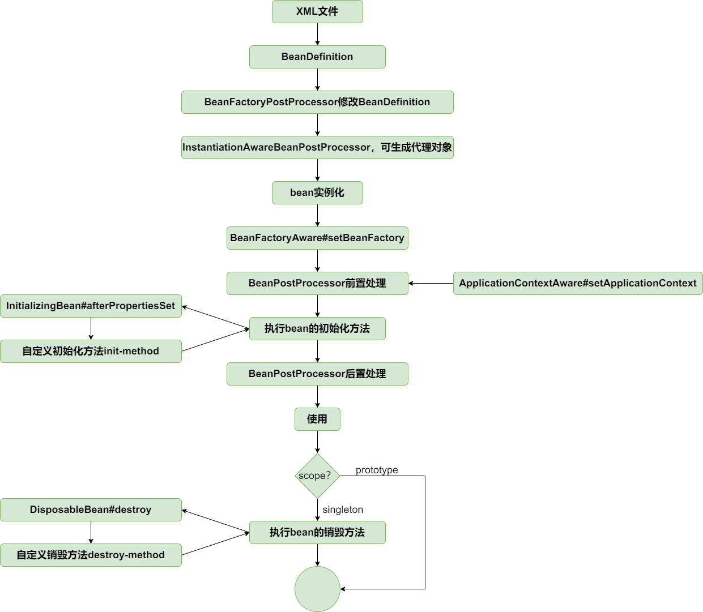

测试：
auto-proxy.xml
```xml
<?xml version="1.0" encoding="UTF-8"?>  
<beans xmlns="http://www.springframework.org/schema/beans"  
       xmlns:xsi="http://www.w3.org/2001/XMLSchema-instance"  
       xmlns:context="http://www.springframework.org/schema/context"  
       xsi:schemaLocation="http://www.springframework.org/schema/beans  
             http://www.springframework.org/schema/beans/spring-beans.xsd        http://www.springframework.org/schema/context        http://www.springframework.org/schema/context/spring-context-4.0.xsd">  
  
    <bean id="worldService" class="top.ningmao.myspring.service.WorldServiceImpl"/>  
  
    <!-- 自动代理创建器 -->  
    <bean class="top.ningmao.myspring.aop.framework.autoproxy.DefaultAdvisorAutoProxyCreator"/>  
  
    <!-- 通知器（定义切点 + 通知） -->  
    <bean id="pointcutAdvisor" class="top.ningmao.myspring.aop.aspectj.AspectJExpressionPointcutAdvisor">  
        <property name="expression" value="execution(* top.ningmao.myspring.service.WorldService.explode(..))"/>  
        <property name="advice" ref="combineAdviceInterceptor"/>  
    </bean>  
    <!-- 通知适配器集合（将 advice 封装为 MethodInterceptor） -->  
    <bean id="combineAdviceInterceptor" class="top.ningmao.myspring.aop.CombineAdviceInterceptor">  
        <property name="beforeAdviceInterceptor" ref="methodBeforeAdviceInterceptor"/>  
        <property name="afterAdviceInterceptor" ref="methodAfterAdviceInterceptor"/>  
        <property name="afterReturningAdviceInterceptor" ref="methodAfterReturningAdviceInterceptor"/>  
        <property name="throwsAdviceInterceptor" ref="methodThrowsAdviceInterceptor"/>  
        <property name="aroundAdviceInterceptor" ref="methodAroundAdviceInterceptor"/>  
    </bean>  
    <!-- 各类通知及其适配器 -->  
    <bean id="methodBeforeAdviceInterceptor" class="top.ningmao.myspring.aop.framework.adapter.MethodBeforeAdviceInterceptor">  
        <property name="advice" ref="beforeAdvice"/>  
    </bean>    <bean id="beforeAdvice" class="top.ningmao.myspring.common.WorldServiceBeforeAdvice"/>  
  
    <bean id="methodAfterAdviceInterceptor" class="top.ningmao.myspring.aop.framework.adapter.MethodAfterAdviceInterceptor">  
        <property name="advice" ref="afterAdvice"/>  
    </bean>    <bean id="afterAdvice" class="top.ningmao.myspring.common.WorldServiceAfterAdvice"/>  
  
    <bean id="methodAfterReturningAdviceInterceptor" class="top.ningmao.myspring.aop.framework.adapter.MethodAfterReturningAdviceInterceptor">  
        <property name="advice" ref="afterReturningAdvice"/>  
    </bean>    <bean id="afterReturningAdvice" class="top.ningmao.myspring.common.WorldServiceAfterReturningAdvice"/>  
  
    <bean id="methodThrowsAdviceInterceptor" class="top.ningmao.myspring.aop.framework.adapter.MethodThrowsAdviceInterceptor">  
        <property name="advice" ref="throwsAdvice"/>  
    </bean>    <bean id="throwsAdvice" class="top.ningmao.myspring.common.WorldServiceThrowsAdvice"/>  
  
    <bean id="methodAroundAdviceInterceptor" class="top.ningmao.myspring.aop.framework.adapter.MethodAroundAdviceInterceptor">  
        <property name="advice" ref="aroundAdvice"/>  
    </bean>    <bean id="aroundAdvice" class="top.ningmao.myspring.common.WorldServiceAroundAdvice"/>  
  
  
</beans>
```
```java
public class AutoProxyTest {

	@Test  
	public void testAutoProxy() throws Exception {  
	    ClassPathXmlApplicationContext applicationContext = new ClassPathXmlApplicationContext("classpath:auto-proxy.xml");  
	    WorldService worldService = applicationContext.getBean("worldService", WorldService.class);  
	    // 因为有环绕通知，所以会走到环绕通知，其余的可以自行测试  
	    worldService.explode();  
	}
}
```

`DefaultAdvisorAutoProxyCreator` 相当于一个“**粘合剂**”，它自动化了代理对象的创建流程：

- 不再需要手动编码代理逻辑

- 只需通过配置定义切入点（Pointcut）与通知（Advice）

- 框架自动完成对象代理与织入


**最终实现了 AOP 与 Bean 生命周期的无缝融合。**


---

# 扩展

## PropertyPlaceholderConfigurer

> 代码分支：property-placeholder-configurer

经常需要将配置信息配置在properties文件中，然后在XML文件中以占位符的方式引用。

实现思路很简单，在bean实例化之前，编辑BeanDefinition，解析XML文件中的占位符，然后用properties文件中的配置值替换占位符。而BeanFactoryPostProcessor具有编辑BeanDefinition的能力，因此PropertyPlaceholderConfigurer继承自BeanFactoryPostProcessor。

测试：
```properties
host=localhost  
port=8080  
env=dev  
base.dev=/api/dev  
region.location=China
```

```xml
<?xml version="1.0" encoding="UTF-8"?>  
<beans xmlns="http://www.springframework.org/schema/beans"  
       xmlns:xsi="http://www.w3.org/2001/XMLSchema-instance"  
       xmlns:context="http://www.springframework.org/schema/context"  
       xsi:schemaLocation="http://www.springframework.org/schema/beans  
             http://www.springframework.org/schema/beans/spring-beans.xsd        http://www.springframework.org/schema/context        http://www.springframework.org/schema/context/spring-context-4.0.xsd">  
  
    <bean class="top.ningmao.myspring.bean.factory.PropertyPlaceholderConfigurer">  
        <property name="location" value="classpath:server-config.properties" />  
    </bean>  
    <bean id="serverConfig" class="top.ningmao.myspring.bean.ServerConfig">  
        <property name="url" value="http://${host}:${port}" />  
        <property name="path" value="${base.${env}}" />  
        <property name="location" value="${region.location}" />  
    </bean>  
</beans>
```

```java
@Test  
public void test() throws Exception {  
    ClassPathXmlApplicationContext applicationContext = new ClassPathXmlApplicationContext("classpath:property-placeholder-configurer.xml");  
    ServerConfig serverConfig = applicationContext.getBean("serverConfig", ServerConfig.class);  
    assertThat(serverConfig.getUrl()).isEqualTo("http://localhost:8080");  
    assertThat(serverConfig.getPath()).isEqualTo("/api/dev");  
    assertThat(serverConfig.getLocation()).isEqualTo("China");  
}
```

---

## 包扫描

> 代码分支：package-scan


结合bean的生命周期，包扫描只不过是扫描特定注解的类，提取类的相关信息组装成BeanDefinition注册到容器中。

在XmlBeanDefinitionReader中解析```<context:component-scan />```标签，扫描类组装BeanDefinition然后注册到容器中的操作在ClassPathBeanDefinitionScanner#doScan中实现。


测试：
```java
@Component
public class Car {

}
```

package-scan.xml
```xml
<?xml version="1.0" encoding="UTF-8"?>  
<beans xmlns="http://www.springframework.org/schema/beans"  
       xmlns:xsi="http://www.w3.org/2001/XMLSchema-instance"  
       xmlns:context="http://www.springframework.org/schema/context"  
       xsi:schemaLocation="http://www.springframework.org/schema/beans  
             http://www.springframework.org/schema/beans/spring-beans.xsd        http://www.springframework.org/schema/context        http://www.springframework.org/schema/context/spring-context-4.0.xsd">  
  
    <context:component-scan base-package="top.ningmao.myspring.bean"/>  
  
</beans>
```

```java
public class PackageScanTest {  
  
    @Test  
    public void testScanPackage() throws Exception {  
        ClassPathXmlApplicationContext applicationContext = new ClassPathXmlApplicationContext("classpath:package-scan.xml");  
  
        Car car = applicationContext.getBean("car", Car.class);  
        assertThat(car).isNotNull();  
    }  
}
```


## Value注解

> 代码分支：value-annotation

在 Spring 框架中，`@Value` 和 `@Autowired` 等注解的实现，精妙地运用了 `BeanPostProcessor` 机制在 Bean 生命周期的特定阶段进行干预。其核心逻辑如下：

1.  **关键切入点：`InstantiationAwareBeanPostProcessor`**

    Spring 定义了一个强大的 `BeanPostProcessor` 子接口——`InstantiationAwareBeanPostProcessor`。它提供了一个名为 `postProcessPropertyValues` 的核心方法，其执行时机恰好在 Bean **实例化**（对象创建）之后，但在**属性填充**（setter调用或字段赋值）之前。这个时间点为实现注解驱动的依赖注入提供了完美的“钩子”。

2.  **核心处理器：`AutowiredAnnotationBeanPostProcessor`**

    `AutowiredAnnotationBeanPostProcessor` 是 `InstantiationAwareBeanPostProcessor` 接口的一个关键实现类，专门负责处理 `@Autowired` 和 `@Value` 等注解。当 Spring 容器通过组件扫描（如 `ClassPathBeanDefinitionScanner#doScan`）启动时，这个处理器会被自动检测并注册到容器中，为后续的拦截做好准备。

3.  **依赖注入的执行流程**

    当 Spring 创建任何一个 Bean 时，其核心方法 `AbstractAutowireCapableBeanFactory#doCreateBean` 会被调用。在该方法内部，一旦目标 Bean 的实例被创建，就会触发 `AutowiredAnnotationBeanPostProcessor` 的 `postProcessPropertyValues` 方法。

4.  **`@Value` 注解的解析**

    在该方法内部，它会通过反射扫描当前 Bean 的字段和方法，寻找 `@Value` 注解。一旦找到，例如 `@Value("${app.version}")`，它会执行以下操作：

    *   提取出占位符表达式 `"${app.version}"`。

    *   为了将这个占位符替换为真实的配置值，它需要一个**字符串值解析器（`StringValueResolver`）**。

    *   这个解析器并非凭空产生，它是由另一个更早执行的组件——`PropertyPlaceholderConfigurer`（或其现代版本 `PropertySourcesPlaceholderConfigurer`）——在加载完 `.properties` 配置文件后，注册到 `BeanFactory` 中的。

    *   最终，`AutowiredAnnotationBeanPostProcessor` 利用这个解析器完成占位符的替换，并通过反射将最终的值直接注入到 Bean 的字段中。

> 思考：当一个字段又有value，又有properties，又有直接定义的值会怎么样呢？

- 我们可以总结出属性注入的优先级顺序（后面的会覆盖前面的）：

    1. **代码中的直接初始化**: 这是最低的优先级，在对象实例化时首先执行。

    2. **@Value注解注入**: 通过BeanPostProcessor在标准属性注入前执行，会覆盖代码中的初始值。

    3. **XML 或 JavaConfig (`<property>,@Bean)` 中的配置**: 在注解注入之后执行，会覆盖@Value注入的值。这是**最高优先级**的配置方式之一（不考虑更动态的配置源，如环境变量等）。

一句话总结：当多种配置方式冲突时，更“外部化”、更“具体明确”的配置（如 XML）通常会覆盖掉更“内部化”、更“默认”的配置（如代码初始化和注解）。

测试：
```java
@Component  
public class ServerConfig {  
  
    @Value("http://${host}:${port}")  
    private String url;  
  
    @Value("${base.${env}}")  
    private String path;  
  
    @Value("${region.location}")  
    private String location;  
}
```

value-annotation.xml
```java
<?xml version="1.0" encoding="UTF-8"?>  
<beans xmlns="http://www.springframework.org/schema/beans"  
       xmlns:xsi="http://www.w3.org/2001/XMLSchema-instance"  
       xmlns:context="http://www.springframework.org/schema/context"  
       xsi:schemaLocation="http://www.springframework.org/schema/beans  
             http://www.springframework.org/schema/beans/spring-beans.xsd        http://www.springframework.org/schema/context        http://www.springframework.org/schema/context/spring-context-4.0.xsd">  
  
    <bean class="org.springframework.beans.factory.PropertyPlaceholderConfigurer">  
        <property name="location" value="classpath:car.properties" />  
    </bean>  
    <context:component-scan base-package="org.springframework.test.bean"/>  
  
</beans>
```

server-config.properties
```properties
host=localhost  
port=8080  
env=dev  
base.dev=/api/dev  
region.location=China
```

```java
@Test  
public void testValueAnnotation() throws Exception {  
    ClassPathXmlApplicationContext applicationContext = new ClassPathXmlApplicationContext("classpath:value-annotation.xml");  
  
    ServerConfig serverConfig = applicationContext.getBean("serverConfig", ServerConfig.class);  
    assertThat(serverConfig.getUrl()).isEqualTo("http://localhost:8080");  
    assertThat(serverConfig.getPath()).isEqualTo("/api/dev");  
    assertThat(serverConfig.getLocation()).isEqualTo("China");  
  
}
```

---

## @Autowired注解

> 代码分支：autowired-annotation

@Autowired注解的处理见AutowiredAnnotationBeanPostProcessor#postProcessPropertyValues

测试：
```java
@Component
public class Car {

}

@Component
public class Person implements InitializingBean, DisposableBean {

	@Autowired
	private Car car;
}
```
autowired-annotation.xml
```xml
<?xml version="1.0" encoding="UTF-8"?>  
<beans xmlns="http://www.springframework.org/schema/beans"  
       xmlns:xsi="http://www.w3.org/2001/XMLSchema-instance"  
       xmlns:context="http://www.springframework.org/schema/context"  
       xsi:schemaLocation="http://www.springframework.org/schema/beans  
             http://www.springframework.org/schema/beans/spring-beans.xsd        http://www.springframework.org/schema/context        http://www.springframework.org/schema/context/spring-context-4.0.xsd">  
  
    <bean class="top.ningmao.myspring.bean.factory.PropertyPlaceholderConfigurer">  
        <property name="location" value="classpath:car.properties" />  
    </bean>  
    <context:component-scan base-package="top.ningmao.myspring.bean"/>  
  
</beans>
```

```java
@Test  
public void testAutowiredAnnotation() throws Exception {  
    ClassPathXmlApplicationContext applicationContext = new ClassPathXmlApplicationContext("classpath:autowired-annotation.xml");  
  
    Person person = applicationContext.getBean(Person.class);  
    assertThat(person.getCar()).isNotNull();  
    assertThat(person.getCar().getBrand()).isEqualTo("xiaomi");  
}
```

---

## fix：没有为代理bean设置属性

> 代码分支: populate-proxy-bean-with-property-values

问题现象：没有为代理bean设置属性

织入逻辑在InstantiationAwareBeanPostProcessor#postProcessBeforeInstantiation中执行，该方法返回非null值时会触发"短路"机制，跳过后续的属性设置流程，导致代理bean缺失必要属性。

核心调整：与Spring框架保持一致，将织入逻辑迁移至更合适的生命周期节点

具体实现：

- 将DefaultAdvisorAutoProxyCreator#postProcessBeforeInstantiation中的织入逻辑

- 迁移到DefaultAdvisorAutoProxyCreator#postProcessAfterInitialization中执行

完善Spring扩展机制：

- 为InstantiationAwareBeanPostProcessor新增postProcessAfterInstantiation方法

- 该方法在bean实例化完成后、属性设置前执行，提供更精细的生命周期控制

> 实例化 → postProcessAfterInstantiation → 属性设置 → 初始化 → postProcessAfterInitialization

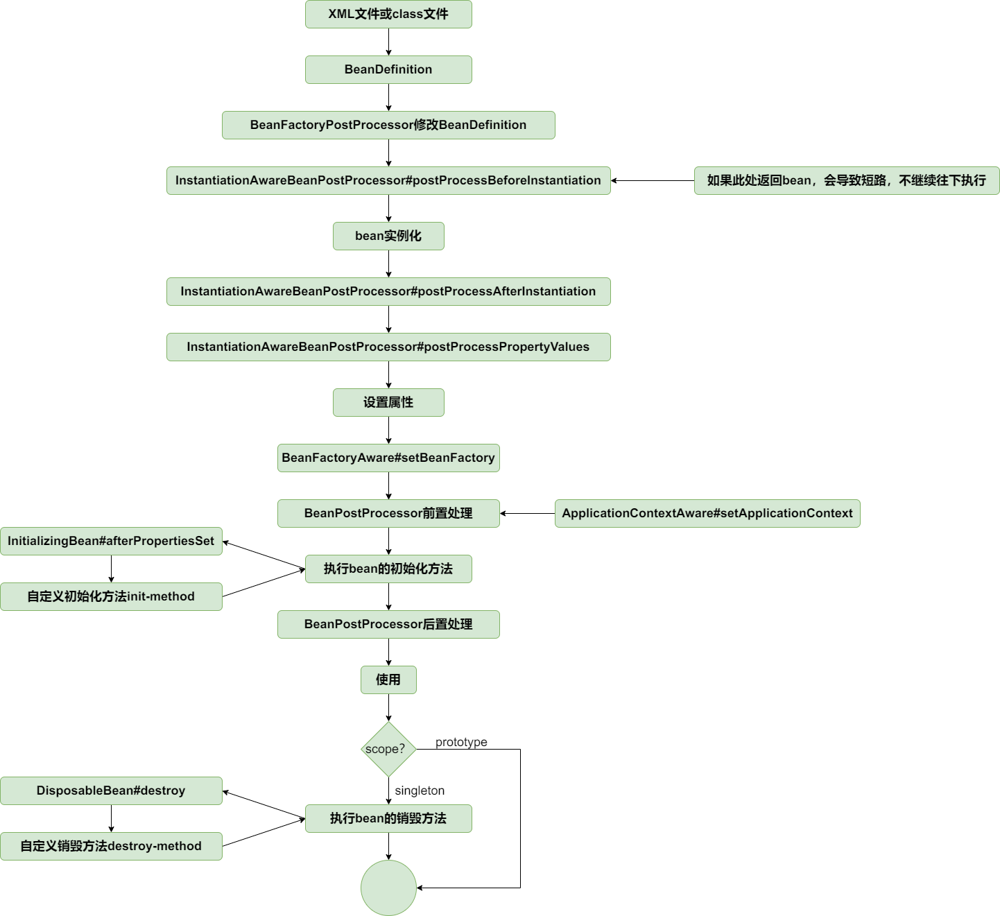

测试：
populate-proxy-bean-with-property-values.xml
```xml
<?xml version="1.0" encoding="UTF-8"?>  
<beans xmlns="http://www.springframework.org/schema/beans"  
       xmlns:xsi="http://www.w3.org/2001/XMLSchema-instance"  
       xmlns:context="http://www.springframework.org/schema/context"  
       xsi:schemaLocation="http://www.springframework.org/schema/beans  
             http://www.springframework.org/schema/beans/spring-beans.xsd        http://www.springframework.org/schema/context        http://www.springframework.org/schema/context/spring-context-4.0.xsd">  
  
    <bean id="worldService" class="top.ningmao.myspring.service.WorldServiceImpl">  
        <property name="name" value="earth"/>  
    </bean>  
    <bean class="top.ningmao.myspring.aop.framework.autoproxy.DefaultAdvisorAutoProxyCreator"/>  
  
    <bean id="pointcutAdvisor" class="top.ningmao.myspring.aop.aspectj.AspectJExpressionPointcutAdvisor">  
        <property name="expression" value="execution(* top.ningmao.myspring.service.WorldService.explode(..))"/>  
        <property name="advice" ref="methodInterceptor"/>  
    </bean>  
  
    <bean id="methodInterceptor" class="top.ningmao.myspring.aop.framework.adapter.MethodBeforeAdviceInterceptor">  
        <property name="advice" ref="beforeAdvice"/>  
    </bean>  
    <bean id="beforeAdvice" class="top.ningmao.myspring.common.WorldServiceBeforeAdvice"/>  
  
</beans>
```

```java
public class WorldServiceImpl implements WorldService {  
  
    private String name;  
  
    @Override  
    public void explode() {  
        System.out.println("The " + name + " is going to explode");  
    }  
  
    @Override  
    public String getName() {  
        return name;  
    }  
  
    public void setName(String name) {  
        this.name = name;  
    }  
}
```

```java
@Test  
public void testPopulateProxyBeanWithPropertyValues() throws Exception {  
    ClassPathXmlApplicationContext applicationContext = new ClassPathXmlApplicationContext("classpath:populate-proxy-bean-with-property-values.xml");  
  
    //获取代理对象  
    WorldService worldService = applicationContext.getBean("worldService", WorldService.class);  
    worldService.explode();  
    assertThat(worldService.getName()).isEqualTo("earth");  
}
```

---

## 类型转换（一）

> 代码分支：type-conversion-first-part

在 Spring 框架中，类型转换是一个至关重要的底层功能，它被广泛应用于数据绑定（如将 HTTP 请求参数绑定到 Controller 方法的入参）、属性注入（如将配置文件中的字符串属性注入为Integer或自定义类型）等场景。Spring 在org.springframework.core.convert.converter包中定义了三种核心的转换器接口，它们共同构成了整个类型转换系统的基石。

### 一、`Converter<S, T>`：一对一的类型转换器

`Converter` 是最基础、最直接的转换器接口，它被设计用于处理**一对一**的、强类型的转换。

#### 1. 接口定义

```java
/**
 * 一个用于类型转换的转换器。
 * @param <S> 源类型 (Source Type)
 * @param <T> 目标类型 (Target Type)
 */
public interface Converter<S, T> {

	/**
	 * 将源对象 S 转换为目标类型 T。
	 * @param source 源对象实例，永远不为 null
	 * @return 转换后的对象
	 */
	T convert(S source);
}
```

*   **特点**：接口定义清晰、带有泛型，因此是类型安全的。实现类只需关注从一个特定类型（S）到另一个特定类型（T）的转换逻辑。

#### 2. 示例：`StringToIntegerConverter`

将 `String` 类型转换为 `Integer` 类型是最常见的需求之一。

```java

public class StringToIntegerConverter implements Converter<String, Integer> {
	@Override
	public Integer convert(String source) {
		// 确保源字符串不为空，避免 NullPointerException
		if (source == null || source.trim().isEmpty()) {
			return null; // 或者根据业务需求抛出异常
		}
		return Integer.valueOf(source);
	}
}
```


### 二、`ConverterFactory<S, R>`：一对多的类型转换器

当源类型固定，但目标类型是一个“家族”（例如，所有数字类型）时，为每个目标类型都创建一个 `Converter` 会显得非常冗余。`ConverterFactory` 正是为了解决这个问题而设计的。

#### 1. 接口定义

```java
/**
 * 用于创建从 S 类型到 R 类型“家族”中特定子类型 T 的转换器的工厂。
 * @param <S> 源类型 (Source Type)
 * @param <R> 目标类型的基类或接口 (Range Type)
 */
public interface ConverterFactory<S, R> {

	/**
	 * 根据具体的目标子类型 T，获取一个能将 S 转换为 T 的 Converter。
	 * @param <T> 目标子类型，是 R 的子类
	 * @param targetType 目标子类型的 Class 对象
	 * @return 一个从 S 到 T 的转换器实例
	 */
	<T extends R> Converter<S, T> getConverter(Class<T> targetType);
}
```
*   **特点**：它本身不执行转换，而是一个**生产 `Converter` 的工厂**。它能够根据你请求的目标子类型，动态地提供一个合适的 `Converter` 实例。

#### 2. 示例：`StringToNumberConverterFactory`

一个典型的例子是将字符串转换为所有 `java.lang.Number` 的子类（如 `Integer`, `Long`, `Float`, `Double` 等）。

```java
public class StringToNumberConverterFactory implements ConverterFactory<String, Number> {  
    @Override  
    public <T extends Number> Converter<String, T> getConverter(Class<T> targetType) {  
        return new StringToNumber<T>(targetType);  
    }  
  
    private static final class StringToNumber<T extends Number> implements Converter<String, T> {  
  
        private final Class<T> targetType;  
  
        public StringToNumber(Class<T> targetType) {  
            this.targetType = targetType;  
        }  
  
        @Override  
        @SuppressWarnings("unchecked")  
        public T convert(String source) {  
            // 处理null和空字符串  
            if (source == null || source.isEmpty()) {  
                return null;  
            }  
  
            // 去除首尾空白字符  
            source = source.trim();  
            if (source.isEmpty()) {  
                return null;  
            }  
  
            try {  
                // Integer类型转换  
                if (targetType.equals(Integer.class)) {  
                    return (T) Integer.valueOf(source);  
                }  
                // Long类型转换  
                else if (targetType.equals(Long.class)) {  
                    return (T) Long.valueOf(source);  
                }  
                // Short类型转换  
                else if (targetType.equals(Short.class)) {  
                    return (T) Short.valueOf(source);  
                }  
                // Byte类型转换  
                else if (targetType.equals(Byte.class)) {  
                    return (T) Byte.valueOf(source);  
                }  
                // Float类型转换  
                else if (targetType.equals(Float.class)) {  
                    return (T) Float.valueOf(source);  
                }  
                // Double类型转换  
                else if (targetType.equals(Double.class)) {  
                    return (T) Double.valueOf(source);  
                }  
                // BigInteger类型转换  
                else if (targetType.equals(BigInteger.class)) {  
                    return (T) new BigInteger(source);  
                }  
                // BigDecimal类型转换  
                else if (targetType.equals(BigDecimal.class)) {  
                    return (T) new BigDecimal(source);  
                }  
                // 不支持的数字类型  
                else {  
                    throw new IllegalArgumentException(  
                            "Cannot convert String [" + source + "] to target class [" + targetType.getName() + "]");  
                }  
            } catch (NumberFormatException ex) {  
                throw new IllegalArgumentException(  
                        "Cannot convert String [" + source + "] to target class [" + targetType.getName() + "]", ex);  
            }  
        }  
    }  
}
```


### 三、`GenericConverter`：通用且强大的转换器

`GenericConverter` 是最灵活、功能最强大的转换器接口。它支持**多对多**的类型转换，并且可以在转换过程中获取更丰富的上下文信息（例如字段注解）。

```java
public interface GenericConverter {

	Set<ConvertiblePair> getConvertibleTypes();

	Object convert(Object source, Class sourceType, Class targetType);
}
```
String类型转换为Boolean类型的实现类：
```java
public class StringToBooleanConverter implements GenericConverter {
	@Override
	public Set<ConvertiblePair> getConvertibleTypes() {
		return Collections.singleton(new ConvertiblePair(String.class, Boolean.class));
	}

	@Override
	public Object convert(Object source, Class sourceType, Class targetType) {
		return Boolean.valueOf((String) source);
	}
}
```
使用:
```java
Boolean flag = new StringToBooleanConverter().convert("true", String.class, Boolean.class);
```


### 四、`ConversionService`：类型转换体系的“指挥官”

以上三种转换器接口定义了“如何转换”，但它们本身并不会被框架自动调用。`ConversionService` 接口扮演了组织和执行者的角色。

*   **核心作用**：它是一个注册中心（Registry），你可以将各种自定义的转换器注册到其中。同时，它也提供了统一的转换入口 `convert(source, targetType)`。

*   **工作流程**：当框架需要进行类型转换时，它会调用 `ConversionService` 的 `convert` 方法。`ConversionService` 会在已注册的所有转换器中，查找最匹配的一个来执行实际的转换工作。

*   **主要实现类**：

    *   **`GenericConversionService`**：一个基础的、可配置的 `ConversionService` 实现。它允许你通过 `addConverter` 方法手动注册你的转换器。

    *   **`DefaultConversionService`**：继承自 `GenericConversionService`，是 Spring Boot 和大多数 Spring 应用中**默认使用**的实现。它在 `GenericConversionService` 的基础上，**预先注册了数百个常用的内置转换器**（如字符串与数字、日期、枚举、集合之间的转换等）。这就是为什么很多时候我们无需自定义转换器，Spring 也能自动完成类型转换的原因。

像你想用Java中的枚举信息去放到数据库中就可能会自定义转换器

测试见TypeConversionFirstPartTest。

## 类型转换（二）

> 代码分支：type-conversion-second-part

#### 1. ConversionServiceFactoryBean：便捷的类型转换服务工厂

为了方便开发者在容器中配置和使用`ConversionService`，Spring提供了`ConversionServiceFactoryBean`。

*   **功能**：它是一个`FactoryBean`，主要作用是创建并配置一个`ConversionService`实例。

*   **默认实现**：在内部，它会创建一个`DefaultConversionService`的实例，这是一个功能完备的通用转换服务。 `DefaultConversionService` 默认注册了大量常用的转换器，能够处理字符串、数字、枚举、集合、Map等多种常见类型之间的转换。

*   **定制化**：开发者可以通过设置其`converters`属性，来注册自定义的转换器（`Converter`, `ConverterFactory`, 或 `GenericConverter`接口的实现），以扩展或覆盖默认的转换行为。

---

#### 2. 容器的感知与整合：AbstractApplicationContext

当你在Spring容器中定义了一个ID为 `conversionService` 的Bean时，Spring容器会在启动过程中的特定阶段自动识别它，并将其设置为容器的内置类型转换器。

这个关键的步骤发生在`AbstractApplicationContext`的`refresh()`方法流程中，特别是在`finishBeanFactoryInitialization`方法被调用时。该方法负责完成Bean工厂的最终初始化，包括初始化所有剩余的非懒加载单例Bean。

**整合机制**：
在`refresh()`方法的`prepareBeanFactory(beanFactory)`阶段，Spring会检查容器中是否存在名为`conversionService`的Bean。如果存在，Spring会获取这个`ConversionService`实例，并将其设置到`BeanExpressionResolver`以及Bean工厂自身中。这样，在后续处理SpEL表达式或进行Bean属性填充时，容器就能够使用这个配置好的转换服务了。

一旦设置成功，这个`ConversionService`实例就会成为整个`ApplicationContext`的“御用”类型转换器。

---

#### 3. 类型转换的两个关键时机

容器在完成`ConversionService`的整合后，会在以下两个主要的场景中自动调用它进行类型转换：

##### **时机一：为Bean填充属性 (`AbstractAutowireCapableBeanFactory#applyPropertyValues`)**

当Spring创建一个Bean并需要为其属性赋值时（例如，从XML配置文件、Java配置或属性文件中读取的值），类型转换就会发生。

##### **时机二：处理`@Value`注解 (`AutowiredAnnotationBeanPostProcessor#postProcessPropertyValues`)**

`@Value`注解通常用于注入外部配置（如`.properties`文件中的值）或SpEL表达式的结果。这些值在注入时通常是`String`类型，也需要被转换成目标字段的类型。


---

#### 4. 兼容旧机制：没有`ConversionService`时的回退方案（不必细究）

你可能会好奇，如果我没有定义`ConversionService`，为什么像`String`到`int`这样的基本转换依然能成功？

这是因为Spring为了保持向下的兼容性，保留了一套基于`java.beans.PropertyEditor`的旧类型转换机制。

*   **功能局限**：它主要设计用于`String`到`Object`的转换，对于任意类型之间的转换（如`Date`到`Long`）支持不佳。

`ConversionService`体系是现代Spring应用中推荐的类型转换方式，因为它更通用、功能更强大且是线程安全的。 旧的`PropertyEditor`机制则作为一种兼容性保障，确保在没有现代转换服务配置的情况下，基础的类型转换依然能够工作。


测试：
```java
public class Car {

	private int price;

	private LocalDate produceDate;
}
```

```java
public class StringToLocalDateConverter implements Converter<String, LocalDate> {

	private final DateTimeFormatter DATE_TIME_FORMATTER;

	public StringToLocalDateConverter(String pattern) {
		DATE_TIME_FORMATTER = DateTimeFormatter.ofPattern(pattern);
	}

	@Override
	public LocalDate convert(String source) {
		return LocalDate.parse(source, DATE_TIME_FORMATTER);
	}
}
```

type-conversion-second-part.xml
```xml
<?xml version="1.0" encoding="UTF-8"?>  
<beans xmlns="http://www.springframework.org/schema/beans"  
       xmlns:xsi="http://www.w3.org/2001/XMLSchema-instance"  
       xmlns:context="http://www.springframework.org/schema/context"  
       xsi:schemaLocation="http://www.springframework.org/schema/beans  
             http://www.springframework.org/schema/beans/spring-beans.xsd        http://www.springframework.org/schema/context        http://www.springframework.org/schema/context/spring-context-4.0.xsd">  
  
    <bean id="car" class="top.ningmao.myspring.bean.Car">  
        <property name="price" value="1000000"/>  
        <property name="produceDate" value="2021-01-01"/>  
    </bean>  
    <bean id="conversionService" class="top.ningmao.myspring.context.support.ConversionServiceFactoryBean">  
        <property name="converters" ref="converters"/>  
    </bean>  
    <bean id="converters" class="top.ningmao.myspring.common.ConvertersFactoryBean"/>  
  
</beans>
```

```java
public class TypeConversionSecondPartTest {

	@Test
	public void testConversionService() throws Exception {
		ClassPathXmlApplicationContext applicationContext = new ClassPathXmlApplicationContext("classpath:type-conversion-second-part.xml");

		Car car = applicationContext.getBean("car", Car.class);
		assertThat(car.getPrice()).isEqualTo(1000000);
		assertThat(car.getProduceDate()).isEqualTo(LocalDate.of(2021, 1, 1));
	}
}
```


# 高级篇

## 解决循环依赖问题（一）：没有代理对象

> 代码分支：circular-reference-without-proxy-bean

好的，我们来详细整理一下 `circular-reference-without-proxy-bean` 这个分支所解决的核心问题：**如何通过二级缓存解决非代理Bean的循环依赖**。

---

### Spring循环依赖解决方案（一）：二级缓存机制

#### 1. 问题的根源：循环依赖的“死循环”

在Spring容器中，当两个或多个Bean相互依赖时，就构成了循环依赖。以最简单的A、B两个类为例：

*   `A` 类中有一个属性是 `B` 类的实例。

*   `B` 类中有一个属性是 `A` 类的实例。

```java
public class A {
    private B b;
    // ... getter and setter
}

public class B {
    private A a;
    // ... getter and setter
}
```

在没有特殊处理的情况下，Spring容器在创建这两个Bean时会陷入一个无法终结的死循环：

1.  **创建 `a`**:

    *   实例化 `A` 对象。

    *   准备为 `A` 对象填充属性，发现它需要一个 `B` 的实例。

    *   于是，暂停 `a` 的创建，转而去创建 `b`。

2.  **创建 `b`**:

    *   实例化 `B` 对象。

    *   准备为 `B` 对象填充属性，发现它需要一个 `A` 的实例。

    *   于是，暂停 `b` 的创建，转而去创建 `a`。

3.  **创建 `a`**:

    *   （回到第一步）发现它需要一个 `B` 的实例...

这个过程会无限重复，直到程序因栈溢出（StackOverflowError）而崩溃。

#### 2. 核心思想：提前暴露Bean引用 (Early Exposure)

解决这个问题的关键在于打破上述的死循环。Spring的思路是：**将Bean的生命周期拆分为“实例化”和“属性填充”两个阶段，并在两者之间，将一个“半成品”的Bean提前暴露出去**。

这意味着，当一个Bean（如`A`）刚刚通过构造函数被创建出来（**实例化**完成），但它的属性（如`b`）还没有被设置（**属性填充**未完成）时，我们就先把这个原始的、不完整的`A`对象的引用存放到一个地方，让其他后续创建的Bean（如`B`）能够提前拿到它。

#### 3. 解决方案：引入二级缓存 (`earlySingletonObjects`)

> 其实调整bean放进singletonObjects（人称一级缓存）的时机到bean实例化后即可解决循环依赖问题。但有earlySingletonObjects可以帮助外面区分完全初始化的Bean和半成品Bean

而spring为了实现“提前暴露”，Spring引入了多级缓存机制。在这个阶段，我们先引入两个核心缓存：

*   **`singletonObjects` (一级缓存)**:

    *   **作用**：存放**完全初始化好**的单例Bean。这是Bean的最终归宿，这里的Bean是成品，可以直接使用。

    *   **别名**：单例池。

*   **`earlySingletonObjects` (二级缓存)**:

    *   **作用**：存放**已实例化但尚未填充属性**的“半成品”Bean。它专门用于解决循环依赖，实现引用的提前暴露。

有了二级缓存后，处理循环依赖的流程变得清晰可行：

1.  **`getBean("a")`**:

    *   检查一级缓存`singletonObjects`，发现没有`a`。

    *   检查二级缓存`earlySingletonObjects`，也没有`a`。

    *   开始创建`a`。首先，**实例化`A`对象**。

    *   **关键一步**：将这个刚实例化、但属性为空的`A`对象放入**二级缓存 `earlySingletonObjects`** 中。

    *   开始为`A`对象填充属性，发现它依赖`b`，于是触发 `getBean("b")`。


2.  **`getBean("b")`**:

    *   检查一级缓存，没有`b`。

    *   检查二级缓存，没有`b`。

    *   开始创建`b`。首先，**实例化`B`对象**。

    *   将这个刚实例化的`B`对象放入**二级缓存 `earlySingletonObjects`** 中。

    *   开始为`B`对象填充属性，发现它依赖`a`，于是触发 `getBean("a")`。


3.  **再次 `getBean("a")`**:

    *   检查一级缓存，没有`a`。

    *   **关键一步**：检查**二级缓存 `earlySingletonObjects`**，**成功找到了**之前放进去的那个“半成品”`A`对象！

    *   直接返回这个`A`对象的引用。


4.  **`b`的创建完成**:

    *   步骤2中的`B`对象成功获取到了`A`的引用，并设置到自己的`a`属性中。

    *   `B`对象的所有属性填充完毕，它成了一个**完整的Bean**。

    *   将完整的`B`对象从二级缓存中移除（如果存在），并放入**一级缓存 `singletonObjects`** 中。

    *   返回完整的`B`对象。


5.  **`a`的创建完成**:

    *   步骤1中的`A`对象成功获取到了完整的`B`对象，并设置到自己的`b`属性中。

    *   `A`对象的所有属性填充完毕，它也成了一个**完整的Bean**。

    *   将完整的`A`对象从二级缓存中移除，并放入**一级缓存 `singletonObjects`** 中。

    *   返回完整的`A`对象。


至此，循环依赖被成功打破，`a`和`b`都被正确地创建和注入。
单测见CircularReferenceWithoutProxyBeanTest#testCircularReference。

#### 4. 局限性：无法解决代理对象的循环依赖

二级缓存机制虽然巧妙，但它有一个致命的缺陷：**无法处理涉及AOP代理的循环依赖**。

问题出在：

*   放入二级缓存（`earlySingletonObjects`）的是**原始的Bean对象**。

*   而经过AOP增强后，最终放入一级缓存（`singletonObjects`）的是**代理对象**。

这意味着，在循环依赖的过程中，一个Bean（如`B`）从二级缓存中获取到的依赖（`A`的原始对象），与最终应用中其他地方获取到的依赖（`A`的代理对象）**不是同一个对象**。这会导致 `b.getA() != a` 的情况发生，从而引发不可预知的问题和数据不一致。

正如 `CircularReferenceWithProxyBeanTest` 单测所揭示的，二级缓存方案在这种场景下会失败。为了解决这个更复杂的问题，Spring引入了第三级缓存，这也就是下一节要填的坑。


## 解决循环依赖问题（二）：有代理对象

> 代码分支：circular-reference-with-proxy-bean

#### 1. 上节遗留的问题：二级缓存的“身份不一致”危机

上一节我们通过引入二级缓存（`earlySingletonObjects`）解决了普通Bean的循环依赖。但这个方案在遇到AOP代理时会失效，根本原因在于：

*   **二级缓存存放的是**：**原始的Bean对象**（通过`new`关键字实例化出来的那个）。

*   **一级缓存最终要求的是**：**AOP代理对象**（在Bean生命周期末端，由`BeanPostProcessor`创建的增强版对象）。

当A需要被代理，并且与B发生循环依赖时（A -> B -> A）：
1.  B在创建过程中需要A，它从二级缓存中获取到了**原始的A对象**并持有其引用。

2.  当整个流程结束后，容器中一级缓存存放的是**A的代理对象**。

3.  这就导致了**身份不一致**：B持有的A（原始对象）和容器持有的A（代理对象）不是同一个实例。任何通过B去调用A的行为都将**绕过AOP代理**，导致AOP切面逻辑（如事务、日志）完全失效。

#### 2. 解决方案核心思想：推迟并统一“早期引用”的创建

为了解决这个问题，Spring必须确保：**无论在循环依赖的过程中，还是在最终完成后，所有Bean获取到的关于A的引用，必须是同一个对象——即最终的那个代理对象。**

这就意味着，不能简单地把原始对象提前暴露出去。必须有一种机制，能够**在第一次需要提前暴露A的引用时，就决策好是否要创建代理，并把这个代理对象暴露出去**。

这个机制，就是三级缓存——`singletonFactories`。

#### 3. 三级缓存的各自职责

*   **`singletonObjects` (一级缓存)**

    *   **作用**：存放完全初始化好的**最终成品Bean**（可能是原始对象，也可能是代理对象）。这是Bean的最终归宿，是真正的“单例池”。

    *   **查找时机**：`getBean`时最先查找的地方。


*   **`earlySingletonObjects` (二级缓存)**

    *   **作用**：存放**提前暴露的Bean引用**（可能是原始对象，也可能是代理对象）。这个缓存的目的是为了**打破三级缓存的循环调用**，确保在一次复杂的循环依赖中，某个Bean的代理对象**只被创建一次**。

    *   **存放内容**：由三级缓存中的工厂（Factory）创建出来的对象。


*   **`singletonFactories` (三级缓存)**

    *   **作用**：存放用于创建“早期Bean引用”的**对象工厂** (`ObjectFactory`)。这是解决AOP代理问题的关键。

    *   **存放内容**：不是Bean对象，而是一个lambda表达式或`ObjectFactory`实例。这个工厂知道如何创建Bean的早期引用（并在需要时应用AOP代理）。

#### 4. 完整流程解析 (A -> B -> A，且A需要被代理)

1.  **`getBean("a")` 启动**:
    *   检查一、二、三级缓存，均未找到`a`。
    *   开始创建`a`。首先，实例化`A`对象。

    *   **关键步骤**: 此时Spring并不直接把原始的A对象放入任何缓存。而是创建一个**对象工厂** (`ObjectFactory`)，并将其存入**三级缓存 `singletonFactories`** 中。

        *   这个工厂 `() -> getEarlyBeanReference("a", a)` 的核心逻辑是：如果`a`需要被AOP代理，就返回其代理对象；否则，返回原始对象。

    *   开始为A对象填充属性，发现它依赖`b`，触发 `getBean("b")`。

2.  **`getBean("b")` 启动**:

    *   检查三级缓存，未找到`b`。

    *   实例化`B`对象，同样为其创建一个对象工厂并存入**三级缓存 `singletonFactories`**。

    *   开始为B对象填充属性，发现它依赖`a`，触发 `getBean("a")`。

3.  **再次 `getBean("a")` (循环依赖的转折点)**:

    *   检查一级缓存 `singletonObjects`，未找到`a`。

    *   检查二级缓存 `earlySingletonObjects`，也未找到`a`。

    *   **关键步骤**: 检查**三级缓存 `singletonFactories`**，**成功找到了**在第1步存入的`a`的对象工厂！

4.  **提前创建代理并暴露**:

    *   Spring从三级缓存中获取到`a`的工厂，并**执行**这个工厂。

    *   工厂内部的`getEarlyBeanReference`方法被调用。它通过`BeanPostProcessor`（如`AutowiredAnnotationBeanPostProcessor`）检查到`A`需要被代理。

    *   因此，一个**A的代理对象被创建出来**。

    *   这个刚创建的**A的代理对象**被放入**二级缓存 `earlySingletonObjects`** 中。

    *   `a`的对象工厂从三级缓存中被移除（因为它已经被使用过了）。

    *   `getBean("a")`调用返回这个**A的代理对象**。

5.  **`b` 的创建完成**:

    *   第2步中的B对象成功获取到了**A的代理对象**，并设置到自己的`a`属性中。

    *   B对象的所有属性填充完毕，它成了一个完整的Bean。

    *   将完整的B对象放入**一级缓存 `singletonObjects`** 中。

    *   `getBean("b")`调用成功返回。

6.  **`a` 的创建完成**:

    *   回到第1步，A对象成功获取到了完整的B对象，并设置到自己的`b`属性中。

    *   A对象的所有属性填充完毕。

    *   **最后一步**: 将这个**已经**在二级缓存中存在的、被完整填充了属性的**A的代理对象**，挪动到**一级缓存 `singletonObjects`** 中。

至此，循环依赖被完美解决。B持有的是A的代理对象，最终容器中存在的也是A的代理对象，两者完全一致。`CircularReferenceWithProxyBeanTest` 单测得以通过。


## 支持懒加载和多切面增强

### 懒加载

> 代码分支:  lazy-init-and-multi-advice

并非所有 Bean 都有必要在 Spring 容器启动时就立即完成创建。随着项目规模的不断扩大，需要管理的 Bean 数量也日益增多。如果每次启动容器都需要加载并初始化大量的 Bean，这无疑会延长应用的启动时间，并造成不必要的资源浪费。

为了解决这个问题，Spring 提供了**懒加载（Lazy Initialization）机制**。我们可以将那些不急于使用或不一定会被用到的 Bean 配置为懒加载，这样它们只会在第一次被真正需要（例如，被其他 Bean 注入或通过 `getBean()` 方法调用）的时候才会被创建。

此外，懒加载也是解决某些**循环依赖**问题的有效手段之一。（后续会讲）

*(注：当前实现是通过 XML 配置，后续会补充注解形式的支持。)*

测试

lazy-test.xml
```xml
<?xml version="1.0" encoding="UTF-8"?>  
<beans xmlns="http://www.springframework.org/schema/beans"  
       xmlns:xsi="http://www.w3.org/2001/XMLSchema-instance"  
       xsi:schemaLocation="http://www.springframework.org/schema/beans http://www.springframework.org/schema/beans/spring-beans.xsd">  
    <bean id="car" class="top.ningmao.myspring.bean.Car" lazyInit="true" init-method="init">  
        <property name="brand" value="porsche"/>  
    </bean></beans>

```


逻辑部分只动了这里，懒加载的核心在于修改 Spring 容器**预初始化单例 Bean**的逻辑。默认情况下，Spring 会在容器初始化阶段的末尾，遍历所有单例 Bean 的定义并创建它们的实例。我们需要在这里加入一个判断，跳过被标记为懒加载的 Bean。
```java
//只有当bean是单例且不为懒加载才会被创建	
public void preInstantiateSingletons() throws BeansException {
		beanDefinitionMap.forEach((beanName, beanDefinition) -> {
			if(beanDefinition.isSingleton()&&!beanDefinition.isLazyInit()){
				getBean(beanName);
			}
		});
	}
```

```java
public class LazyInitTest {
    @Test
    public void testLazyInit() throws InterruptedException {
        ClassPathXmlApplicationContext applicationContext = new ClassPathXmlApplicationContext("classpath:lazy-test.xml");
        System.out.println(System.currentTimeMillis()+":applicationContext-over");
        TimeUnit.SECONDS.sleep(1);
        Car c= (Car) applicationContext.getBean("car");
        c.showTime();//显示bean的创建时间
    }
}
```

关闭懒加载的输出:

```
1756255846579:applicationContext-over
1756255846579:bean create
```

开启懒加载：

```
1756255949517:applicationContext-over
1756255950551:bean create
```

可以清楚的看到开启和不开启懒加载bean的创建时机的差异

---

### **实现多切面AOP：拦截器链的设计与应用**

> 代码分支: lazy-init-and-multi-advice

#### 1. 背景：从单一增强到多切面支持

在之前的实现中，我们虽然完成了对目标方法的增强，但一个关键的限制是仅支持单个切面。在真实的开发场景中，一个方法常常需要被多个切面（如日志、事务、权限校验等）同时增强。为了实现这一核心功能，我们借鉴了 Spring AOP 的经典设计——**拦截器链（Interceptor Chain）**。

本篇将从代理对象的创建入口 `ProxyFactory` 开始，深入剖析一个调用是如何穿过层层拦截器，最终抵达目标方法并返回的完整流程。

#### 2. 入口：`ProxyFactory` 的职责

`ProxyFactory` 是我们获取AOP代理对象的顶层入口。为了更贴合 Spring 的实现，我们让 `ProxyFactory` 继承自 `AdvisedSupport`，使其本身就成为一个AOP配置的容器。它的核心职责是根据配置，选择并创建一个合适的AOP代理。

```java
public class ProxyFactory extends AdvisedSupport {

    public Object getProxy() {
        return createAopProxy().getProxy();
    }

    private AopProxy createAopProxy() {
        // 如果强制使用CGLIB，或者目标对象没有实现任何接口
        if (this.isProxyTargetClass() || this.getTargetSource().getTargetClass().length == 0) {
            return new CglibAopProxy(this);
        }
        // 默认使用JDK动态代理
        return new JdkDynamicAopProxy(this);
    }
}
```
`ProxyFactory` 的逻辑很简单：根据 `proxyTargetClass` 属性和目标对象的特征，决定是使用 `CglibAopProxy`（基于类继承）还是 `JdkDynamicAopProxy`（基于接口实现）。

#### 3. 核心：JDK动态代理的 `invoke` 方法

两种代理的实现思路大同小异，我们以 `JdkDynamicAopProxy` 为例。所有对代理对象的调用都会被转发到其 `invoke` 方法中，这里是AOP拦截器链的起点。

```java
@Override
public Object invoke(Object proxy, Method method, Object[] args) throws Throwable {
    Object target = advised.getTargetSource().getTarget();
    Class<?> targetClass = target.getClass();
    Object retVal;

    // 1. 获取应用于当前方法的拦截器链
    List<Object> chain = this.advised.getInterceptorsAndDynamicInterceptionAdvice(method, targetClass);

    // 如果没有拦截器，直接调用目标方法
    if (chain == null || chain.isEmpty()) {
        return method.invoke(target, args);
    } else {
        // 2. 将拦截器链和调用信息封装成 MethodInvocation
        MethodInvocation invocation =
                new ReflectiveMethodInvocation(proxy, target, method, args, targetClass, chain);
        
        // 3. 执行拦截器链
        retVal = invocation.proceed();
    }
    return retVal;
}
```
`invoke` 方法的执行流程可以清晰地分为三步。

##### **步骤 1: 获取拦截器链**

`AdvisedSupport` 负责根据当前调用的方法，筛选出所有适用的拦截器。

**`AdvisedSupport#getInterceptorsAndDynamicInterceptionAdvice`**
```java
public List<Object> getInterceptorsAndDynamicInterceptionAdvice(Method method, Class<?> targetClass) {
    // 简单的缓存机制，避免重复计算
    Integer cacheKey = method.hashCode();
    List<Object> cached = this.methodCache.get(cacheKey);
    if (cached == null) {
        // 通过 AdvisorChainFactory 获取拦截器链
        cached = this.advisorChainFactory.getInterceptorsAndDynamicInterceptionAdvice(this, method, targetClass);
        this.methodCache.put(cacheKey, cached);
    }
    return cached;
}
```
实际的筛选逻辑委托给了 `DefaultAdvisorChainFactory`。

**`DefaultAdvisorChainFactory#getInterceptorsAndDynamicInterceptionAdvice`**
```java
public List<Object> getInterceptorsAndDynamicInterceptionAdvice(AdvisedSupport config, Method method, Class<?> targetClass) {
    Advisor[] advisors = config.getAdvisors().toArray(new Advisor[0]);
    List<Object> interceptorList = new ArrayList<>(advisors.length);
    Class<?> actualClass = (targetClass != null ? targetClass : method.getDeclaringClass());

    for (Advisor advisor : advisors) {
        if (advisor instanceof PointcutAdvisor) {
            PointcutAdvisor pointcutAdvisor = (PointcutAdvisor) advisor;
            // 阶段一：类匹配
            if (pointcutAdvisor.getPointcut().getClassFilter().matches(actualClass)) {
                MethodMatcher mm = pointcutAdvisor.getPointcut().getMethodMatcher();
                // 阶段二：方法匹配
                if (mm.matches(method, actualClass)) {
                    // 匹配成功，提取 Advisor 中的 Advice (已封装为 Interceptor)
                    interceptorList.add(advisor.getAdvice());
                }
            }
        }
    }
    return interceptorList;
}
```
这里的逻辑是：遍历所有已注册的 `Advisor`，通过其内部的 `Pointcut` 进行两阶段匹配（先匹配类，再匹配方法），如果都匹配成功，就将 `Advisor` 中的 `Advice`（即拦截器）添加到返回列表中。

这里可能有读者会疑惑，我们明明是要获取MethodInterceptor，可AdvisedSupport的getAdvice()返回的是Advice(增强),其实如果我们点开MethodInterceptor的源码，我们会发现MethodInterceptor继承了Interceptor接口，而Interceptor又继承了Advice接口。因为这里的Advice和MethodInterceptor我们都是用的AOP联盟的接口，所以特此说明一下。

##### **步骤 2: 封装调用信息**

获取到拦截器链后，我们将本次调用的所有上下文信息（代理对象、目标对象、方法、参数、拦截器链等）封装到一个 `ReflectiveMethodInvocation` 对象中。这个对象将在拦截器之间传递，代表了整个调用过程。

这里也是重写了ReflectiveMethodInvocation的实现，来支持多切面。

```java
	public ReflectiveMethodInvocation(Object proxy,Object target, Method method, Object[] arguments,Class<?> targetClass,List<Object> chain) {
		this.proxy=proxy;
		this.target = target;
		this.method = method;
		this.arguments = arguments;
		this.targetClass=targetClass;
		this.interceptorsAndDynamicMethodMatchers=chain;
	}
```

##### **步骤 3: 执行拦截器链**

`ReflectiveMethodInvocation` 的 `proceed()` 方法是整个拦截器链能够依次执行的关键。

**`ReflectiveMethodInvocation#proceed()`**
```java
private int currentInterceptorIndex = -1;

public Object proceed() throws Throwable {
    // 1. 如果所有拦截器都已执行完毕
    if (this.currentInterceptorIndex == this.interceptorsAndDynamicMethodMatchers.size() - 1) {
        // 调用原始目标方法
        return method.invoke(this.target, this.arguments);
    }

    // 2. 获取下一个拦截器
    Object interceptor = this.interceptorsAndDynamicMethodMatchers.get(++this.currentInterceptorIndex);

    // 3. 调用该拦截器的 invoke 方法，并将自身(this)作为参数传入
    return ((MethodInterceptor) interceptor).invoke(this);
}
```
**执行机制解析：**

*   `proceed()` 方法通过一个索引 `currentInterceptorIndex` 来追踪当前执行到哪个拦截器。

*   每个拦截器在其 `invoke` 方法内部，负责调用 `methodInvocation.proceed()` 来**手动触发下一个拦截器**的执行。

*   当最后一个拦截器调用 `proceed()` 时，索引达到末尾，最终的目标方法被调用。

#### 4. 增强顺序的奥秘：拦截器的实现

`proceed()` 方法本身只是一个简单的递归/链式调用触发器，它并不关心通知的类型（`Before`, `After` 等）。**保证增强逻辑在正确时机执行的责任，落在了每个具体的拦截器实现上。**

**`MethodBeforeAdviceInterceptor` (前置通知)**
```java
public Object invoke(MethodInvocation mi) throws Throwable {
    // 1. 先执行前置增强逻辑
    this.advice.before(mi.getMethod(), mi.getArguments(), mi.getThis());
    // 2. 再调用 proceed()，将控制权交给下一个拦截器
    return mi.proceed();
}
```

**`AfterReturningAdviceInterceptor` (后置返回通知)**
```java
public Object invoke(MethodInvocation mi) throws Throwable {
    // 1. 先调用 proceed()，让后续的拦截器和目标方法先执行
    Object retVal = mi.proceed();
    // 2. 在目标方法成功返回后，再执行后置增强逻辑
    this.advice.afterReturning(retVal, mi.getMethod(), mi.getArguments(), mi.getThis());
    return retVal;
}
```
通过这种设计，`Before` 类型的拦截器在链式调用前执行操作，而 `After` 类型的拦截器在链式调用后执行操作。这个递归的调用过程与二叉树的先序/后序遍历有异曲同工之妙。

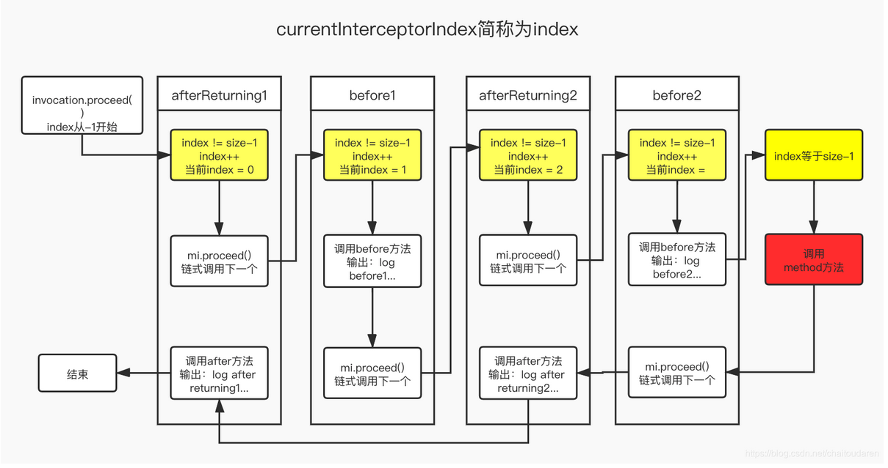

#### 5. 功能验证与测试

> **运行提示**:
>
> *   建议使用 **Java 8** 进行测试，高版本 JDK 可能因反射限制与 CGLIB 产生冲突。
>
> *   若使用高版本 JDK，可能需要在 JVM 参数中添加 `--add-opens java.base/java.lang=ALL-UNNAMED`。

##### **场景一：编程方式配置多切面**

我们通过 `ProxyFactory` 手动配置两个切面（一个前置，一个后置），并应用到同一个方法上。

**测试代码 `DynamicProxyTest.java`:**
```java
@Test
public void testAdvisor() throws Exception {
    // 1. 创建被代理的目标对象  
    WorldService worldService = new WorldServiceImpl();

    // Advisor 是 Pointcut (切点) 和 Advice (通知) 的组合  
    String expression = "execution(* top.ningmao.myspring.service.WorldService.explode(..))";

    // 2. 配置第一个切面：前置通知 (BeforeAdvice)    AspectJExpressionPointcutAdvisor advisor = new AspectJExpressionPointcutAdvisor();  
    advisor.setExpression(expression); // 定义切点  
    MethodBeforeAdviceInterceptor methodInterceptor = new MethodBeforeAdviceInterceptor(new WorldServiceBeforeAdvice());
    advisor.setAdvice(methodInterceptor); // 定义通知  

    // 3. 配置第二个切面：后置通知 (AfterReturningAdvice)    AspectJExpressionPointcutAdvisor advisor1 = new AspectJExpressionPointcutAdvisor();  
    advisor1.setExpression(expression); // 复用切点  
    MethodAfterReturningAdviceInterceptor afterReturningAdviceInterceptor = new MethodAfterReturningAdviceInterceptor(new WorldServiceAfterReturningAdvice());
    advisor1.setAdvice(afterReturningAdviceInterceptor); // 定义通知  

    // 4. 使用 ProxyFactory 创建代理  
    ProxyFactory factory = new ProxyFactory();
    TargetSource targetSource = new TargetSource(worldService);
    factory.setTargetSource(targetSource);      // 设置目标对象  
    factory.setProxyTargetClass(true);         // 强制使用 CGLIB 代理  
    factory.addAdvisor(advisor);               // 添加第一个切面  
    factory.addAdvisor(advisor1);              // 添加第二个切面  

    // 5. 获取代理对象  
    WorldService proxy = (WorldService) factory.getProxy();

    // 6. 调用方法，触发 AOP 通知链  
    proxy.explode();
}
```

**预期输出:**
```
BeforeAdvice: do something before the earth explodes
The null is going to explode
AfterReturningAdvice: do something after the earth explodes return
```
输出结果完美地符合预期，证明拦截器链按照 `Before -> Target Method -> After` 的顺序正确执行。

##### **场景二：声明方式集成Bean生命周期**

更进一步，我们将多切面配置融入到 Bean 的生命周期中，通过 `DefaultAdvisorAutoProxyCreator` 实现自动代理。

**`auto-proxy.xml` 配置文件:**
```xml
<?xml version="1.0" encoding="UTF-8"?>
<beans xmlns="http://www.springframework.org/schema/beans"
       xmlns:xsi="http://www.w3.org/2001/XMLSchema-instance"
       xmlns:context="http://www.springframework.org/schema/context"
       xsi:schemaLocation="http://www.springframework.org/schema/beans  
             http://www.springframework.org/schema/beans/spring-beans.xsd        http://www.springframework.org/schema/context        http://www.springframework.org/schema/context/spring-context-4.0.xsd">

    <bean id="worldService" class="top.ningmao.myspring.service.WorldServiceImpl"/>
    <bean id="worldServiceWithException" class="top.ningmao.myspring.service.WorldServiceWithExceptionImpl"/>

    <!-- 自动代理创建器 -->
    <bean class="top.ningmao.myspring.aop.framework.autoproxy.DefaultAdvisorAutoProxyCreator"/>

    <!-- 通知器（定义切点 + 通知） -->
    <bean id="pointcutAdvisor" class="top.ningmao.myspring.aop.aspectj.AspectJExpressionPointcutAdvisor">
        <property name="expression" value="execution(* top.ningmao.myspring.service.WorldService.explode(..))"/>
        <property name="advice" ref="combineAdviceInterceptor"/>
    </bean>
    <!-- 通知适配器集合（将 advice 封装为 MethodInterceptor） -->
    <bean id="combineAdviceInterceptor" class="top.ningmao.myspring.aop.CombineAdviceInterceptor">
        <property name="beforeAdviceInterceptor" ref="methodBeforeAdviceInterceptor"/>
        <property name="afterAdviceInterceptor" ref="methodAfterAdviceInterceptor"/>
        <property name="afterReturningAdviceInterceptor" ref="methodAfterReturningAdviceInterceptor"/>
        <property name="throwsAdviceInterceptor" ref="methodThrowsAdviceInterceptor"/>
        <property name="aroundAdviceInterceptor" ref="methodAroundAdviceInterceptor"/>
    </bean>
    <!-- 各类通知及其适配器 -->
    <bean id="methodBeforeAdviceInterceptor" class="top.ningmao.myspring.aop.framework.adapter.MethodBeforeAdviceInterceptor">
        <property name="advice" ref="beforeAdvice"/>
    </bean>    <bean id="beforeAdvice" class="top.ningmao.myspring.common.WorldServiceBeforeAdvice"/>

    <bean id="methodAfterAdviceInterceptor" class="top.ningmao.myspring.aop.framework.adapter.MethodAfterAdviceInterceptor">
        <property name="advice" ref="afterAdvice"/>
    </bean>    <bean id="afterAdvice" class="top.ningmao.myspring.common.WorldServiceAfterAdvice"/>

    <bean id="methodAfterReturningAdviceInterceptor" class="top.ningmao.myspring.aop.framework.adapter.MethodAfterReturningAdviceInterceptor">
        <property name="advice" ref="afterReturningAdvice"/>
    </bean>    <bean id="afterReturningAdvice" class="top.ningmao.myspring.common.WorldServiceAfterReturningAdvice"/>

    <bean id="methodThrowsAdviceInterceptor" class="top.ningmao.myspring.aop.framework.adapter.MethodThrowsAdviceInterceptor">
        <property name="advice" ref="throwsAdvice"/>
    </bean>    <bean id="throwsAdvice" class="top.ningmao.myspring.common.WorldServiceThrowsAdvice"/>

    <bean id="methodAroundAdviceInterceptor" class="top.ningmao.myspring.aop.framework.adapter.MethodAroundAdviceInterceptor">
        <property name="advice" ref="aroundAdvice"/>
    </bean>    <bean id="aroundAdvice" class="top.ningmao.myspring.common.WorldServiceAroundAdvice"/>


</beans>
```

**测试代码:**
```java
@Test
public void testAutoProxy() throws Exception {
    ClassPathXmlApplicationContext applicationContext = new ClassPathXmlApplicationContext("classpath:auto-proxy.xml");
    // 直接从容器中获取 Bean，它应该已经被自动代理
    WorldService worldService = applicationContext.getBean("worldService", WorldService.class);
    worldService.explode();
}
```

**输出结果:** 与编程方式完全一致，证明多切面已成功融入 Bean 的自动化生命周期管理。

# AI

## Chat

### 最简单的聊天实现

>  simple-chat-model

```java
public interface ChatModel {  
  
    /**  
     * 最简单的调用方式 - 发送文本，获取文本回复  
     *  
     * @param message 用户消息  
     * @return AI 的回复文本  
     */  
    String call(String message);  
}
```

测试
```java
@Test  
public void testMockChatModel() {  
    // 创建 Mock ChatModel    
    ChatModel chatModel = new MockChatModel("NingMao");  
  
    // 调用  
    String response = chatModel.call("你好，Sprout AI！");  
  
    // 验证  
    assertThat(response).isNotNull();  
    assertThat(response).contains("你好，Sprout AI！");  
    System.out.println("AI回复: " + response);  
}
```

# 其他

- 微信：ningmaohlyz
- 短视频，b站与抖音搜索宁猫
- 求Star，fork，欢迎pr

